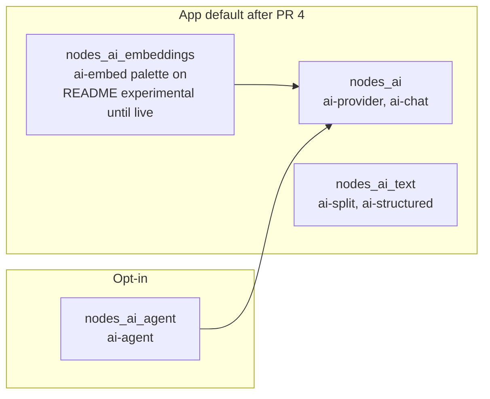
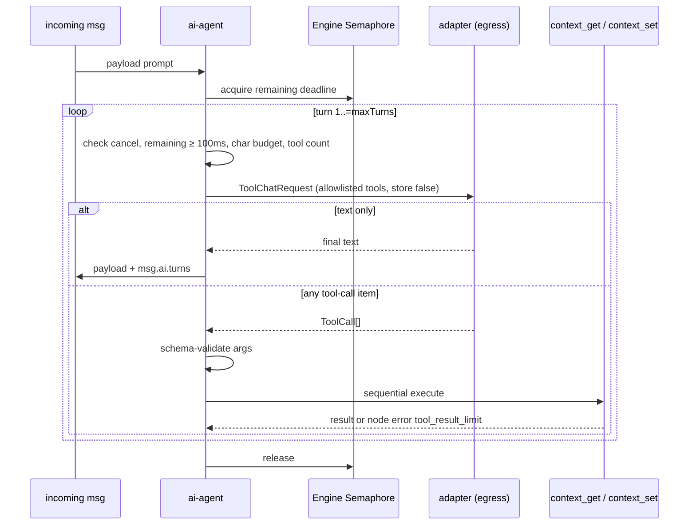

# Phase 6 Design: Selective AI Nodes

Status: implemented locally — key decisions accepted 2026-10-05  
Author: EdgeLinkd maintainers  
Date: 2026-10-04  
Depends on: phases 0–5 on `master` (`43b3dbf`)  
Schema: Copilot `NodeMetadata` version **1** (unchanged)

## Overview

Phase 6 adds four EdgeLinkd-specific node families, in increasing operational risk: a local
deterministic text splitter, a local structured-output validator, embeddings through the existing
`ai-provider`, and a bounded agent/tool loop. Media and extra provider SKUs stay out until there
is demonstrated demand.

The existing default `nodes_ai` surface stays one-shot `ai-provider` + `ai-chat` and still
rejects tools/stream/`response_format`. The only request-shape delta on shipped OpenAI/xAI
Responses (chat, Copilot, and later the agent) is `"store": false`. A custom `baseUrl` that
rejects the field fails loud (HTTP error, no omit-on-error fallback). New families are
subfeatures. Embeddings and the agent reuse `adapter.rs`, `EgressPurpose::AiProvider`, and
`credentials.apiKey` on `ai-provider`. Local families do no I/O. A disabled family disappears from
the editor and from the live registry; a flow that still names it fails deploy with
`EdgelinkError::NotSupported`, never the silent `unknown` node.

## Background & Motivation

Phases 0–5 closed the security and Copilot contract this work sits on: egress (`b092696`),
encrypted credentials (`29a27b3`), ingress (`b93d052`), optional history (`7c34b8e`), and typed
registry metadata (`43b3dbf`). The runtime already ships one global `ai-provider` and one flow
`ai-chat` under `crates/core/src/runtime/nodes/ai_nodes/`. Chat is one-shot: `complete_with_policy`
in `adapter.rs`, timeout 100 ms..=120 s, temperature 0..=2, tools/streaming/`response_format`
rejected at deploy (`chat.rs` `reject_unsupported`, `provider.rs` `reject_unsupported`).

README still lists `ai-agent` as unchecked. The z8 adoption plan (risk 40–60%) names provider
drift, cost loops, secret exposure, and tool misuse as the failure modes. z8run is a reference,
not a transplant. These nodes are **not** Node-RED core: they are not registered in
`scripts/specs_diff.json` and they do not use mocha titles.

Adjacent honesty gap (out of this phase's ship): `parser_nodes/json.rs` currently drops
`msg.schema` without validating it (`// TODO: Implement JSON schema validation`). Success-path
pytest titles that inject a schema still run and **pass** because validation is a no-op. Error-
asserting schema tests are skipped because the harness cannot read `helper.log()`, not because
schema was declared out of scope. Phase 6 does not extend that Node-RED node and must not claim
Ajv. Structured output is a new type.

## Goals & Non-Goals

### Goals

1. `ai-split`: local, deterministic chunking. No network.
2. `ai-structured`: local JSON parse + bounded JSON Schema subset. Fail loud on mismatch.
3. `ai-embed`: embeddings for providers that actually have an embeddings HTTP API.
4. `ai-agent`: bounded tool loop with explicit tools, limits, cancellation, and no deploy tool.
5. Subfeatures so `--no-default-features` can drop each family. `nodes_ai` (provider+chat) stays
   the default-on AI baseline.
6. Ordinary CI uses loopback mocks. Every production-claimed provider has a documented opt-in
   live procedure. Keys never enter the repo, the design, logs, history, or Copilot prompts.
7. Editor HTML, `/nodes` catalog, and Copilot schema v1 hints for every shipped type.
8. Rollback: hide the family; deployed graphs that need it fail loudly; `ai-provider` credentials
   remain readable while a family is disabled.

### Non-goals

- Phase 7 WASM, React Flow, auto-deploy, unrestricted agents.
- Porting every z8run SaaS/AI node, Node-RED dashboard widgets, or Ajv on the JSON node.
- A second HTTP client, a production `ProviderKind::Mock`, Voyage/new providers, image/audio
  nodes, tiktoken, or claiming Cortex/Anthropic embeddings.
- `specs_diff.json` entries (these are not upstream Node-RED nodes).
- Changing `ai-chat` into a tool loop. Chat keeps rejecting `tools` / `stream` /
  `response_format`.
- Version bump, tag, or release.

## Key Decisions

| Decision | Choice | Rationale |
|---|---|---|
| Subfeatures | `nodes_ai` unchanged (provider+chat). `nodes_ai_text` = split+structured. `nodes_ai_embeddings`. `nodes_ai_agent`. | Plan asks for focused gates. Local text has no `reqwest` need; embeddings/agent need `nodes_ai`. |
| Default-on | App `default` gains `nodes_ai_text` in PR 3. `nodes_ai_embeddings` joins `default` in PR 4 so the palette has the node; README stays **unchecked / experimental** until live OpenAI **and** xAI `embed_live` runs. `nodes_ai_agent` stays **off** in `default` and `full`. | Product preference for landed families; do not tick the roadmap from mocks. Agent is the 40–60% risk item. |
| HTTP | Extend `adapter.rs` (`send_json`, `ProviderSettings`, `EgressPurpose::AiProvider`). No second client. Retry wraps new entry points only, never `send_json`. | One egress + credential path. Putting retry in `send_json` would change `ai-chat` and Copilot. |
| Embeddings v1 | OpenAI and xAI only. Anthropic and Cortex: `NotSupported` at deploy. `ai-embed.model` is **required** (no `defaultModel` fallback). v1 omits `dimensions` on xAI even if that API accepts the field. | Chat `defaultModel` is a chat SKU; posting it to `/embeddings` 4xxs. Anthropic has no embeddings API. Cortex embed is `/api/v2/cortex/inference:embed`, not `{chat baseUrl}/embeddings`. |
| Agent providers v1 | OpenAI, xAI, Anthropic. Cortex: `NotSupported`. | Chat Completions tools on Cortex are unverified; do not claim from mocks. |
| Agent wire names | `context_get` / `context_set` (`^[a-zA-Z0-9_-]{1,64}$`). Editor labels may be “Get context” / “Set context”. | OpenAI/xAI/Anthropic reject dotted function names. |
| Schema crate | No `jsonschema`. In-house Draft-07 **subset**. Unknown keywords fail loud; a small annotation set is ignored. | Embedded budget. Ignoring `$ref`/`allOf` is fake support; rejecting `$schema` makes ordinary documents undeployable. |
| Splitter algorithm | Unicode scalar `chars()` windows with overlap; optional separator pack. Not tokens, not bytes, not graphemes. | Deterministic, no tokenizer crate, stable across platforms. |
| Agent tools | Closed enum: `context_get`, `context_set` only. Default store **provider** must be `memory` at deploy (`NotSupported` otherwise). Single-segment keys. No exec, file, HTTP, MQTT, shell, or deploy. | Plan forbids arbitrary tools and autonomous deploy. Nested propex and a `localfilesystem` default store are durable side channels. |
| Mock | Loopback Axum (existing `adapter.rs` tests). Never a registry `mock` kind. | A production mock type would appear in `/nodes` and Copilot. |
| Disabled type | Owned list: all `ai-*` plus `postgres` / `postgres-config` / `redis` / `redis-config`. Missing from inventory → `NotSupported`. Third-party names still map to `unknown`. **Not** `modbus`/`scan` in this phase. | `unknown.rs` never reads `msg_rx`. `modbus`/`scan` are off in the app default; fail-loud would reject leftover graphs that today deploy. |
| Token accounting | Char budgets + provider `usage` when present. No tiktoken. | Tokenizer tables are too large for the embedded budget. |
| JSON node | Unchanged. | Success-path schema tests currently pass without validating; error-path schema tests are harness-skipped. Phase 6 must not claim Ajv. |
| Responses `store` | Send `store: false` on every OpenAI/xAI Responses body (existing chat, Copilot, agent). | Provider-side retention of prompts and tool results is a secret-exfil path. Omit rather than send `true`. |
| Secrets in `Debug` | Custom `Debug`/`Display` on `ProviderSettings` redacts `api_key`. | Today's `#[derive(Debug)]` leaks the key; `hide_secret` only covers some `Err` strings. |

## Proposed Design

### Feature flags

Root `Cargo.toml` (app):

```text
nodes_ai              = edgelink-core/nodes_ai + edgelink-web/nodes_ai     # existing, default-on
nodes_ai_text         = edgelink-core/nodes_ai_text + edgelink-web/nodes_ai_text
nodes_ai_embeddings   = nodes_ai + core/web embeddings features
nodes_ai_agent        = nodes_ai + core/web agent features
```

`crates/core/Cargo.toml`:

```text
nodes_ai              = ["reqwest"]          # unchanged
nodes_ai_text         = []                   # no extra crates
nodes_ai_embeddings   = ["nodes_ai"]
nodes_ai_agent        = ["nodes_ai"]
```

App `default`: current default, plus `nodes_ai_text` from PR 3, plus `nodes_ai_embeddings` from
PR 4. Not `nodes_ai_agent`. `full` = `default` + `rqjs_bindgen` (still no agent).
`--no-default-features` drops all of them. `edgelink-core`'s own `default` stays without AI.

`crates/pymod`: enable `nodes_ai` + `nodes_ai_text` in the same commit as the first AI pytest
(PR 2). Do **not** enable `nodes_ai_embeddings` or `nodes_ai_agent` on pymod; embed and agent
HTTP tests are Rust-only (`pytest.ini` `timeout = 5` is too short for live HTTP, and agent is
opt-in).

`crates/web` mirrors the four features. HTML copy is a per-file `(feature, filename)` loop
like `copy_db_editor` (see Editor / PR 1). `/nodes` tests are `cfg`'d per type.



### Module layout and `cfg` matrix

```text
crates/core/src/runtime/nodes/ai_nodes/
  mod.rs           # cfg submods; complete_for_engine only under nodes_ai
  adapter.rs       # nodes_ai: ProviderKind, ProviderSettings, send_json, chat + embed + tool-chat
  provider.rs      # nodes_ai: ai-provider
  chat.rs          # nodes_ai: ai-chat
  split.rs         # nodes_ai_text
  structured.rs    # nodes_ai_text
  schema.rs        # nodes_ai_text
  embed.rs         # nodes_ai_embeddings
  agent.rs         # nodes_ai_agent
  tools.rs         # nodes_ai_agent
```

`nodes/mod.rs` opens the module on **any** AI subfeature (Cargo already makes embeddings/agent
depend on `nodes_ai`, but the gate must list them so a typo in Cargo.toml cannot silently skip
the module):

```rust
#[cfg(any(
    feature = "nodes_ai",
    feature = "nodes_ai_text",
    feature = "nodes_ai_embeddings",
    feature = "nodes_ai_agent"
))]
pub(crate) mod ai_nodes;
```

Inside `ai_nodes/mod.rs`:

```rust
#[cfg(feature = "nodes_ai")]
mod adapter;
#[cfg(feature = "nodes_ai")]
mod chat;
#[cfg(feature = "nodes_ai")]
mod provider;

#[cfg(feature = "nodes_ai_text")]
mod schema;
#[cfg(feature = "nodes_ai_text")]
mod split;
#[cfg(feature = "nodes_ai_text")]
mod structured;

#[cfg(feature = "nodes_ai_embeddings")]
mod embed;

#[cfg(feature = "nodes_ai_agent")]
mod agent;
#[cfg(feature = "nodes_ai_agent")]
mod tools;

#[cfg(feature = "nodes_ai")]
pub(crate) async fn complete_for_engine(...) { ... }
```

`Engine::complete_ai` stays `#[cfg(feature = "nodes_ai")]` in `engine.rs`. Embed/agent adapter
functions live in `adapter.rs` under `nodes_ai` (the crate feature their Cargo.toml already
implies).

Required check, added to CI’s existing minimal-feature block in PR 2:

```text
cargo check -p edgelink-core --no-default-features --features core,nodes_ai_text
```

That build must not link `reqwest` or compile `adapter.rs` / `chat.rs` / `provider.rs`.

### Loud failure for owned types

`flow.rs` `populate_nodes` and `engine.rs` `load_global_nodes` currently map a missing registry
type to `unknown` / `unknown.global` (warn + swallow). That is the Node-RED extra-node backstop
(`AGENTS.md` rule 10) and must stay for third-party names.

Add `edgelink_owned_node_type(name) -> bool` in `runtime/nodes/mod.rs` covering **only**:

`ai-provider`, `ai-chat`, `ai-split`, `ai-structured`, `ai-embed`, `ai-agent`,
`postgres`, `postgres-config`, `redis`, `redis-config`.

Do **not** include `modbus` or `scan` in Phase 6. Those types are off in the app default; a
default binary that today deploys a leftover `modbus` node as `unknown` would start rejecting
the whole graph. That breaking change is a follow-up, not this phase.

If the type is owned and `reg.get` is `None`, return

```text
EdgelinkError::NotSupported("node type 'ai-agent' is not compiled in this build")
```

`Engine::prepare_flows` therefore rejects the candidate; `deploy.rs` stays the only writer and
never persists a graph that cannot activate. Credentials for `ai-provider` are untouched: that
type lives in `nodes_ai`, not in the agent/embeddings/text gates.

The owned list is a second handwritten set (Phase 5 avoided that for the catalog). It is
justified because the type must be known when it is **not** compiled. Drift test (PR 1):

- every **compiled** inventory type that is feature-gated (`ai-*`, postgres, redis) appears in
  the list;
- `ai-agent` is owned and, until PR 5 registers it, missing from inventory → `NotSupported`;
- a third-party name (`nodered-foo`) still maps to `unknown`.

Postgres/redis bite `--no-default-features` only (they are in the app default).

### Adapter reuse

Do not add a client. `ProviderSettings` + `send_json` already:

- attach `EgressPurpose::AiProvider` when policy is not `Off`;
- cap timeout by `policy.request_timeout()`;
- bound the body with `policy.max_response_bytes()` (default 1 MiB);
- redact `api_key` via `hide_secret` on some `Err` paths.

Replace `#[derive(Debug)]` on `ProviderSettings` with a manual `Debug`/`Display` that prints
`api_key: "***"`. New request types must not carry the key. Never `log::debug!("{:?}", request)`.
Cap node error strings at 512 characters; do not interpolate rejected payloads or tool
arguments.

`send_json` stays retry-free. Retries wrap **new** entry points only (`embed_with_policy`,
`complete_tools_with_policy`). Existing `complete_with_policy` / Copilot `complete_for_engine`
do not retry.

New request types live next to `ChatRequest`. `ChatMessage { role, content }` is **not** the
agent transcript (see wire format below).

```rust
pub(crate) struct EmbedRequest {
    pub model: String,
    pub input: Vec<String>,          // 1..=32
    pub dimensions: Option<u32>,     // OpenAI only in v1; must be None for xAI
    pub timeout: Duration,
}

pub(crate) struct EmbedResponse {
    pub vectors: Vec<Vec<f64>>,
    pub model: String,
    pub provider: String,
    pub prompt_tokens: Option<u32>,
}

/// Wire name: `^[a-zA-Z0-9_-]{1,64}$`. Deploy rejects any other.
pub(crate) struct ToolSpec {
    pub name: &'static str,
    pub description: &'static str,
    pub parameters: serde_json::Value, // subset schema
}

/// Stateless transcript. Not ChatMessage; not provider `previous_response_id`.
pub(crate) enum TranscriptItem {
    UserText(String),
    AssistantText(String),
    /// Echoed back on the next HTTP call (OpenAI/xAI `function_call`, Anthropic `tool_use`).
    FunctionCall { call_id: String, name: String, arguments_raw: String },
    FunctionResult { call_id: String, output: String },
}

pub(crate) struct ToolChatRequest {
    pub model: String,
    pub system: Option<String>,
    pub items: Vec<TranscriptItem>,
    pub tools: Vec<ToolSpec>,
    pub temperature: Option<f64>,
    pub max_tokens: Option<u32>,
    pub timeout: Duration,
}

/// If the provider output contains any tool-call item, the turn is Calls even when text
/// is also present. Do not emit assistant text until a later turn returns text only.
pub(crate) enum ToolChatOutput {
    Text(ChatResponse),
    Calls(Vec<ToolCall>),
}

pub(crate) struct ToolCall {
    /// OpenAI/xAI Responses `call_id`; Anthropic `tool_use_id`. Not `id` vs `call_id` mixups.
    pub call_id: String,
    pub name: String,
    pub arguments: serde_json::Value, // parsed object; keep arguments_raw on TranscriptItem
}
```

`ChatRequest` / `complete_with_policy` stay the Copilot and `ai-chat` path (no tools field).
Agent calls `complete_tools_with_policy`. Embeddings call `embed_with_policy`.

Provider mapping:

| Kind | Chat (existing) | Embeddings v1 | Agent tools v1 |
|---|---|---|---|
| `openai` | `POST {base}/responses` | `POST {base}/embeddings` | `POST {base}/responses` with `tools` |
| `xai` | `POST {base}/responses` | `POST {base}/embeddings` | `POST {base}/responses` with `tools` |
| `anthropic` | `POST {base}/v1/messages` | **NotSupported** | `POST {base}/v1/messages` with `tools` |
| `cortex` | `POST {base}/chat/completions` | **NotSupported** | **NotSupported** |

Omit unsupported optional fields rather than sending them (same rule as Copilot omitting
temperature in `complete_for_engine`). `encoding_format` other than the default float, `stream`,
and image inputs are `NotSupported`. `dimensions` on an `ai-embed` whose provider kind is xAI
is `NotSupported` at deploy even though public xAI docs accept the field — v1 omits it; this is
not “API missing.” Anthropic/Cortex embeddings remain “API missing / different path.”

Capability is resolved at **node build**, not first message: globals load first
(`engine.rs` `load_global_nodes` then `load_flows`). `provider_from_flow` grows a kind accessor
used by `AiEmbedNode::build` / `AiAgentNode::build`. A graph whose `ai-provider` is Anthropic
and whose flow contains `ai-embed` fails deploy.

#### OpenAI / xAI Responses bodies (chat already shipped + agent)

Every Responses POST, including existing `responses_complete`, includes `"store": false`.
Fixtures assert the field is present and is not `true`. If a host ignores `store`, the
operator’s contract with that host applies; EdgeLinkd still must not opt in.

Chat (only `"store": false` is new vs today’s `responses_complete`):

```json
{ "model": "...", "input": [ {"role":"user","content":"..."} ], "store": false, "max_output_tokens": 32 }
```

`max_output_tokens` is sent when `ChatRequest.max_tokens` is `Some`, matching
`adapter.rs` `responses_complete` (not `max_tokens`). Copilot/`ai-chat` already use that mapping.

Agent request, first turn. `ToolChatRequest.max_tokens` is the **internal** name; the Responses
wire field is `max_output_tokens`. Agent `maxTokens` defaults to 1024, so the field is always
present on agent calls:

```json
{
  "model": "…",
  "store": false,
  "max_output_tokens": 1024,
  "tools": [{
    "type": "function",
    "name": "context_get",
    "description": "Read a context key",
    "parameters": { "type": "object", "properties": { "…": "…" }, "required": ["scope","key"], "additionalProperties": false }
  }],
  "input": [
    { "role": "system", "content": "…" },
    { "role": "user", "content": "…" }
  ]
}
```

Agent response that is a tool call (text in the same `output` array is ignored for emitting;
the turn is `Calls`):

```json
{
  "output": [{
    "type": "function_call",
    "call_id": "call_abc",
    "name": "context_get",
    "arguments": "{\"scope\":\"flow\",\"key\":\"foo\"}"
  }]
}
```

Next agent request **statelessly** resends the full `input` (no `previous_response_id`):

```json
{
  "model": "…",
  "store": false,
  "max_output_tokens": 1024,
  "tools": ["…same…"],
  "input": [
    { "role": "user", "content": "…" },
    { "type": "function_call", "call_id": "call_abc", "name": "context_get", "arguments": "{\"scope\":\"flow\",\"key\":\"foo\"}" },
    { "type": "function_call_output", "call_id": "call_abc", "output": "{\"ok\":true,\"value\":1}" }
  ]
}
```

`arguments` on the wire is a **JSON string**. Parse to `Value` before schema validation; keep
the raw string on `TranscriptItem::FunctionCall` for the echo.

#### Anthropic Messages bodies (agent)

No `role: "tool"`. Tools use `input_schema`. Round-trip id is `tool_use_id`.

```json
{
  "model": "…",
  "max_tokens": 1024,
  "system": "…",
  "tools": [{
    "name": "context_get",
    "description": "Read a context key",
    "input_schema": { "type": "object", "properties": { "…": "…" }, "required": ["scope","key"], "additionalProperties": false }
  }],
  "messages": [
    { "role": "user", "content": "…" },
    { "role": "assistant", "content": [
      { "type": "tool_use", "id": "toolu_01", "name": "context_get", "input": {"scope":"flow","key":"foo"} }
    ]},
    { "role": "user", "content": [
      { "type": "tool_result", "tool_use_id": "toolu_01", "content": "{\"ok\":true,\"value\":1}" }
    ]}
  ]
}
```

Request-shape tests must assert `call_id` / `tool_use_id` round-trip, `store: false` and
`max_output_tokens` (not `max_tokens`) on Responses, Anthropic `max_tokens`, and that `role`
is never `"tool"` for Anthropic — not merely that a POST happened.

#### Retries (new entry points only)

- **Embeddings** (`embed_with_policy`): one immediate retry on connect failure, timeout, 429,
  5xx. No retry on 4xx. No `Retry-After` parsing in v1. Correctness-idempotent; a timeout-then-
  retry can still double-bill.
- **Agent** (`complete_tools_with_policy`): one immediate retry of the **current** HTTP attempt
  on connect failure / timeout / 429 / 5xx **only if that attempt has not been parsed as
  `Calls`**. Committed tools from **previous** turns do not forbid retrying a later model call.
  Do not retry a response that already included tool-call items (would double-exec
  `context_set`). No retry after cancel. No retry on 4xx.

```mermaid
sequenceDiagram
  participant N as ai-embed / ai-agent
  participant P as AiProviderNode
  participant E as EgressPolicy
  participant H as provider HTTP
  N->>P: provider_from_flow(id)
  P-->>N: settings, client, egress handle
  N->>E: http_client(AiProvider, url)
  E-->>N: governed client or deny
  N->>H: POST embeddings or tool-chat
  H-->>N: JSON (bounded, UTF-8)
  Note over N: hide_secret on every error path; store false on Responses
```

### `ai-split` (`nodes_ai_text`)

Local. Caps: `["ai"]`. No config-node ref. No secrets.

Match `ai-chat` registration: `node_hints!` then `#[flow_node]`, no `#[derive]` on the node
struct; `Deserialize` lives on a separate config struct.

```text
node_hints!("ai-split", caps = ["ai"])
#[flow_node("ai-split", red_name = "ai-split", inputs = 1, outputs = 1)]
```

Config (editor empty string = default, same empty-as-none pattern as `ai-chat`):

| Field | Default | Bounds | Notes |
|---|---|---|---|
| `chunkSize` | 512 | 1..=8192 | Unicode scalar count |
| `overlap` | 0 | 0..chunkSize | Error if `overlap >= chunkSize` when `chunkSize > 0` |
| `separator` | `""` | max 16 chars; `chars().count() < chunkSize` | Empty: window. Non-empty: pack. Deploy error if separator ≥ chunkSize |
| `maxChunks` | 256 | 1..=256 | Error if the split would exceed this; **no partial emit** |
| `property` | `payload` | non-empty | Input/output property |

Limits: input UTF-8 bytes ≤ 1_048_576. Empty or non-string value → node error, not coerce.
Object/array/buffer are errors (pipe through `json`/`template` first).

#### Reference algorithm

Let `chars` be `source.chars().collect::<Vec<char>>()`. Indices and lengths are in scalars.

**Empty separator (window).** `step = chunkSize - overlap`.

```text
if chars.is_empty() { error }
i = 0
while i < chars.len():
    end = min(i + chunkSize, chars.len())
    emit chars[i..end]
    if end == chars.len(): break
    i += step
```

Overlap reconstruction (`chunks[0] + chunks[1][overlap:] + …`) is a **unit-test helper** for
the window path only. It is **not** `join` behaviour (`join.rs` concatenates payloads as-is).
Do not claim reconstruction for packed mode.

**Non-empty separator (pack).** Split on the exact substring (not regex). Consecutive
separators produce empty segments; keep them. Overlap does **not** apply to packed chunks.

```text
current = ""
for seg in segments:
    if seg.chars().count() > chunkSize:
        if current is not empty: emit current; current = ""
        hard-window seg with the empty-separator algorithm (overlap applies only here)
        continue
    candidate = seg if current is empty else current + separator + seg
    if candidate.chars().count() <= chunkSize:
        current = candidate
    else:
        emit current
        current = seg
if current is not empty: emit current
```

Skip emitting a chunk whose char count is 0.

**`maxChunks`:** if the would-be list is longer, error and emit nothing.

| Input | chunkSize | overlap | separator | Chunks |
|---|---:|---:|---|---|
| `abcdef` | 4 | 0 | `""` | `abcd`, `ef` |
| `abcdef` | 4 | 2 | `""` | `abcd`, `cdef` |
| `abcdefgh` | 3 | 1 | `""` | `abc`, `cde`, `efg`, `gh` |
| `ab\ncd\nef` | 5 | 0 | `\n` | `ab\ncd`, `ef` |
| `xxxx` | 3 | 0 | `yy` | `xxx`, `x` (separator absent from source → one-segment windows) |
| `aa--bbbb--c` | 3 | 1 | `--` | `aa`, `bbb`, `bb`, `c` (`bbbb` is oversize: hard-window with overlap 1) |

Tests pin this **chunks** table. Do not assert a packed round-trip (`ab\ncd` + `ef` is not
`ab\ncd\nef`; hard-windowed `bbbb` does not restore `--`). Overlapped windows (`overlap > 0`)
are for retrieval, not for round-trip through `join`.

Reject at deploy: `stream`, `tiktoken`, `model`, `provider`, `tokens`.

#### Output and `join`

`join.rs` groups on **one** `msg.parts.id` per split. All chunks of one inbound message share
that id. Allocate it **once** per split operation: `format!("{node_id}:{msgid}")` when `_msgid`
is present, else a per-node monotonic counter (not `rand`, not per-chunk). Two concurrent
splits on one node must not share an id (counter is under the same mutex as any other node
state, or use `{node_id}:{msgid}` which is already unique per message).

Send path: **clone-before-mutate**. `deep_clone` tails first; write chunk 0 onto the original
`MsgHandle` last. Sequential `fan_out_one` on port 0 (the loop in `split.rs` ~547–549 is the
send pattern; that node currently builds a new handle per part and does not reuse the inbound
handle — `ai-split` may reuse chunk 0 only after tails are cloned).

Each message:

- `property` = chunk string;
- `parts` = `{ id, type: "string", index, count }` with `index`/`count` as numbers (`index`
  from 0);
- `ai.chunk` = `{ index, count, offset }` (`offset` = char index in the source).

Tests: source-reassembly through `join` in `auto` mode is **only** empty-separator `overlap = 0`
(table row 1: `abcd`+`ef` → `abcdef`). Do not assert `joined == original` on packed rows
(`ab\ncd`+`ef` concatenates to `ab\ncdef`, not `ab\ncd\nef`). Packed `join`, if tested at all,
asserts concatenated payloads and shared `parts.id` grouping only. Do not run `join` against
overlapped windows. Two concurrent splits do not share `parts.id`. Status green `"ok"` / red
on error. Catchable via `with_uow`.

### `ai-structured` (`nodes_ai_text`)

Local. Caps: `["ai"]`. No network.

```text
node_hints!("ai-structured", caps = ["ai"])
#[flow_node("ai-structured", red_name = "ai-structured", inputs = 1, outputs = 1)]
```

| Field | Default | Notes |
|---|---|---|
| `property` | `payload` | Value to parse/validate |
| `schemaSource` | `node` | `node` or `msg` |
| `schema` | required if source=node | JSON object or JSON string, compiled at deploy |
| `output` | `payload` | Written validated value |

`schemaSource=node`: parse and compile in `build()`. Empty/invalid JSON → deploy error.
`schemaSource=msg`: `schema` node field must be empty; at runtime require `msg.schema` object.
Mixing (node schema plus `msg.schema`) → node error, not silent override.

Input: string → `serde_json::from_str` then validate; object/array → validate as-is; other
types → error. On success write the **parsed object** to `output` (not the original string).
Remove `msg.schema` before fan-out when it was the schema source (Node-RED JSON node does this;
keeps secrets-in-schema from travelling). On mismatch: catchable node error, no fan-out.

#### Schema subset (`schema.rs`)

Three columns. Implementation must not drift into “skip unknown keys.”

| Treat | Keywords |
|---|---|
| **Allow** (enforce) | `type` (`string\|number\|integer\|boolean\|object\|array\|null`, or a homogeneous array of those), `properties`, `required`, `additionalProperties` **boolean only**, `items` (single schema, not tuple), `enum`, `const`, `minLength`, `maxLength`, `minimum`, `maximum` (inclusive), `minItems`, `maxItems` |
| **Ignore** (annotations) | `$schema`, `$id`, `$comment`, `title`, `description`, `default`, `examples` |
| **Reject** (`NotSupported` at compile) | `$ref`, `$anchor`, `$defs`/`definitions`, `allOf`, `anyOf`, `oneOf`, `not`, `if`/`then`/`else`, `format`, `pattern`, `patternProperties`, `additionalProperties` as a nested schema, `prefixItems`, `unevaluated*`, `dependent*`, and any other key |

An empty schema object `{}` means “any JSON value” (used for `context_set.value`). Integer:
JSON number with no fractional part.

Compile-time limits: schema JSON ≤ 32 KiB; nesting depth ≤ 8; `properties` count ≤ 64;
`enum` length ≤ 64; `enum` string length ≤ 256.

No extra crate. `serde_json::Value` walk.

This is **not** the JSON node's Ajv path and is not registered in `specs_diff.json`.

### `ai-embed` (`nodes_ai_embeddings`)

```text
node_hints!("ai-embed", refs = ["provider" => "ai-provider"], caps = ["ai", "network"])
#[flow_node("ai-embed", red_name = "ai-embed", inputs = 1, outputs = 1)]
```

| Field | Default | Bounds |
|---|---|---|
| `provider` | required | existing `ai-provider` id |
| `model` | **required**, no default | empty → **deploy error**. Do **not** fall back to `ai-provider.defaultModel` (that is a chat SKU). |
| `dimensions` | omit | OpenAI only; 1..=4096. Set on xAI → `NotSupported` at deploy. |
| `timeoutMs` | 30000 | 100..=120000 |
| `property` | `payload` | |

Editor placeholder is an embedding id (e.g. `text-embedding-3-small` for OpenAI). Do not
pre-fill a chat SKU. Do not add `defaultEmbedModel` on `ai-provider` in this phase.

Input: string → one vector; array of strings → batch, 1..=32 entries, each ≤ 8192 chars,
combined UTF-8 ≤ 64 KiB. Empty string / empty array / non-text elements → error.

Output:

- one input string → `property` is `Variant::Array` of `Variant::Number` (f64);
- batch → array of those arrays, same order as input (`index` from provider `data[].index`);
- `msg.ai` = `{ provider, model, promptTokens? }`.

Vector length > 4096 or non-float components → error. `base64` encoding is `NotSupported`.

`is_link_type` in `engine.rs` adds `ai-provider` and `ai-embed` so `/status.links` retains them
after redeploy (same reason postgres/redis were added). Link **text** is a reason code.
`ai-chat` stays off that list.

Editor credentials: none on `ai-embed`. Key stays on `ai-provider` (`credentials.rs` `AI_PROVIDER`
`apiKey` password field). `fields_for` does not grow.

README: do not tick `ai-embed` in PR 4. Palette may ship; the roadmap line stays unchecked
until OpenAI **and** xAI live runs exist (PR 6).

### `ai-agent` (`nodes_ai_agent`, default **off**)

```text
node_hints!("ai-agent", refs = ["provider" => "ai-provider"], caps = ["ai", "network"])
#[flow_node("ai-agent", red_name = "ai-agent", inputs = 1, outputs = 1)]
```

README checkbox remains until the feature is compiled in the app default; the line names
`--features nodes_ai_agent`.

| Field | Default | Bounds |
|---|---|---|
| `provider` | required | `ai-provider` (chat-capable kinds only; Cortex → deploy `NotSupported`) |
| `model` | provider `defaultModel` | chat SKU; empty uses the provider default (unlike `ai-embed`) |
| `system` | `""` | ≤ 4 KiB |
| `tools` | required, non-empty | subset of the closed enum; each name `^[a-zA-Z0-9_-]{1,64}$` or deploy `NotSupported` |
| `maxTurns` | 4 | 1..=8 |
| `maxToolCalls` | 8 | 1..=16 |
| `timeoutMs` | 30000 | 100..=120000 **wall clock for the whole loop** |
| `maxTokens` | 1024 | 1..=8192 per HTTP call |
| `maxContextChars` | 8000 | 1..=32000 accumulated transcript text |
| `maxToolResultChars` | 1024 | 1..=4096; overflow **aborts the node**, no slice into the next prompt |
| `temperature` | omit | 0..=2 if set |

#### Deadline

```text
deadline = Instant::now() + timeoutMs
remaining = deadline.saturating_duration_since(Instant::now())
http_timeout = min(node.timeoutMs, remaining, egress.request_timeout())
if http_timeout < 100ms: error timeout / cancelled, do not start another HTTP or tool
```

Semaphore acquire uses `remaining`. `tokio::select!` on `stop_token` **and** `sleep_until(deadline)`
around every HTTP call. Test: mock HTTP sleeps 20 s, `timeoutMs = 1000` → node error, **no
second call**.

#### Closed tool enum

Editor multi-select; stored as a string array of **wire names**.

| Wire name | Editor label | Args (subset schema) | Effect |
|---|---|---|---|
| `context_get` | Get context | below | Read. Missing key → tool **error string**, not a panic. |
| `context_set` | Set context | below | Write. Serialized `value` ≤ 4 KiB. |

`context_get.parameters`:

```json
{
  "type": "object",
  "properties": {
    "scope": { "type": "string", "enum": ["node", "flow", "global"] },
    "key": { "type": "string", "minLength": 1, "maxLength": 64 }
  },
  "required": ["scope", "key"],
  "additionalProperties": false
}
```

`context_set.parameters`:

```json
{
  "type": "object",
  "properties": {
    "scope": { "type": "string", "enum": ["node", "flow", "global"] },
    "key": { "type": "string", "minLength": 1, "maxLength": 64 },
    "value": {}
  },
  "required": ["scope", "key", "value"],
  "additionalProperties": false
}
```

After schema validation, `key` must also match `^[A-Za-z0-9_-]{1,64}$` (one propex segment: no
`.` `/`). Dotted keys are a validation error, not a nested write. `scope=node` is **this**
agent’s `BaseFlowNodeState.context`. Flow/global use `flow.context()` / `engine.context()`.

`store` is not in the schema. If the model sends `store`, `additionalProperties: false` fails
validation. v1 always uses the engine **default** store (`Context::set_one(None, …)`). That
store’s **provider** must be `"memory"`. At `AiAgentNode::build`, the engine config is
`options: Option<&config::Config>` (the same argument every flow node already receives):

- `None` — treat the default store provider as `"memory"`, matching `ContextManager::default()`
  and `build_test_engine` → `Engine::with_json(..., None)`. Agent unit tests that pass no TOML
  must deploy.
- `Some(cfg)` — read `[runtime.context] default` and `stores.<name>.provider`. Require
  `provider == "memory"`. Any other provider, including `localfilesystem`, is
  `EdgelinkError::NotSupported("ai-agent requires the default context store to use the memory provider")`.

A host whose configured default is a durable file store cannot deploy the agent. Tests: `None`
deploys; a TOML default of `localfilesystem` does not. `context_set` is still a bounded
`change` node driven by the model, including prompt-injected JSON, and a committed set is not
rolled back on cancel.

Forbidden in the node `tools` array (deploy `NotSupported`): `exec`, `shell`, `file`, `http`,
`mqtt`, `deploy`, `flows`, `network`, `eval`, `js`, any name with `.`, and any name outside
`^[a-zA-Z0-9_-]{1,64}$`. Unknown tool name in config → `NotSupported` at deploy.

Model-requested tool not on the allowlist → do not execute; append a denial string (≤ 512
chars); count against `maxToolCalls`; after two denials of the same name in one run, abort the
loop (`tool_denied`).

#### Argument validation, ordering, repeats

Before execute, run `schema.rs` on the parsed arguments object against that tool’s
`parameters`. Malformed → tool error string (≤ 512 chars, no raw args echoed) + count against
`maxToolCalls`, no execute.

If serialized arguments exceed 4 KiB, do not execute (`tool_args_limit`). If a successful
tool’s **output** serialized length exceeds `maxToolResultChars`, do **not** slice it into the
transcript: fail the node (`tool_result_limit`). Secrets and context values must not be
silently cropped into the next prompt.

Multiple `ToolCall`s in one turn: execute **sequentially** in array order. Before each call,
if `toolCallsSoFar >= maxToolCalls`, abort (`tool_limit`) without executing that call. Stop
the remaining list on cancel.

Repeat hash: `sha256(name || 0x1f || canonical_json(arguments))` where `canonical_json` is
recursive BTreeMap key sort then compact `serde_json::to_string` (no insignificant whitespace).
Two identical `context_set`s in one run are allowed; the **third** identical `(name, canonical
args)` aborts (`repeated_tool_call`).

#### Concurrency

Production cap: **2** in-flight agent loops per process, held on `Engine` as
`#[cfg(feature = "nodes_ai_agent")] agent_slots: Arc<tokio::sync::Semaphore>` (not a
process-wide `LazyLock`, and **not** an unconditional Engine field). The acquire path and the
test injector live under the same `cfg`. Tests inject a semaphore; the concurrency test uses
**1** permit to prove the error path. Document the cap of 2 in README / `LIVE.md`. Combined
with the existing per-node mpsc (one in-flight message per node instance). Acquire with the
remaining deadline; failure → `ai-agent concurrency limit`.

Cancellation: after cancel, do not start another tool. A `context_set` that already committed
is not rolled back. Redeploy cancels via the node stop token the same way `ai-chat` does.
Test: cancel after `set` leaves the value (memory store); default `localfilesystem` is rejected
at deploy; dotted key → validation error.



Loop exit: model returns text-only, or any bound hit (turns, tools, chars, time, cancel,
denial streak, repeated call, `tool_result_limit`). Bound hit is a **node error** (catchable),
not a silent truncated success. Success payload is the final assistant text; `msg.ai` holds
`{ provider, model, turns, toolCalls }` where `toolCalls` is `[{ name, ok }]` — **not**
arguments or values.

`ai-chat` continues to reject `tools` at deploy. Only `ai-agent` sends tool specs.

No tool may call `POST /flows`, Copilot, or the engine redeploy path.

### Editor

New HTML under `crates/web/ai-editor/`, numbered after the DB editors:

| File | Type | Feature |
|---|---|---|
| `90-ai-provider.html` | `ai-provider` | `nodes_ai` (existing) |
| `91-ai-chat.html` | `ai-chat` | `nodes_ai` (existing) |
| `96-ai-split.html` | `ai-split` | `nodes_ai_text` |
| `97-ai-structured.html` | `ai-structured` | `nodes_ai_text` |
| `98-ai-embed.html` | `ai-embed` | `nodes_ai_embeddings` |
| `99-ai-agent.html` | `ai-agent` | `nodes_ai_agent` |

**PR 1** rewrites root `build.rs` `copy_ai_editor` from today’s all-or-nothing
`cfg(feature = "nodes_ai")` copy/delete of 90+91 into a `copy_db_editor`-style loop:
`(feature, filename)` copy when enabled, `remove_file` when disabled. Stale HTML is the hole
`append_bundled_editor` cannot close by itself (`allowed` only filters live registry types).

Category `function`, colour `#E6E0F8`, same as `ai-chat`. `ai-embed` / `ai-agent` `provider`
default `type: "ai-provider"`. `handlers/nodes.rs` `append_bundled_editor` remains the second
filter. Extend `html_register_types_are_in_the_json_catalog` with `cfg` asserts per type.

No new credential types. No new Axum routes. Copilot stays `/assistant/*` (ingress class
`copilot`). Node HTTP is still webhook/editor classes.

`node_hints!` immediately before `#[flow_node]` / `#[global_node]`, matching `chat.rs` /
`provider.rs`. Do not put `#[derive(Debug)]` on the node struct (that is the E0774 trap when
hints sit between derive and the struct). `Deserialize` belongs on the raw config struct.

### Copilot metadata

Schema v1 unchanged. New types appear because inventory is the only catalog. Authoritative
checks already reject unknown types, global types in drafts, missing `provider` refs, and
secret field names. `ai-embed` / `ai-agent` auto-fill a unique existing `ai-provider` the same
way `ai-chat` does (`materialize_draft`).

Phase 5's design listed optional `feature` on the catalog; it is **not** implemented in
`catalog_json` (`assistant.rs`). Phase 6 does not add it: a disabled family is simply absent.
Do not invent a second type list.

Update `crates/web/assistant-skills/edgelink-flow-developer/references/common-patterns.md`
with one example each for split → embed and chat → structured. The skill already forbids
inventing types not in the catalog.

### Mock provider (CI)

Keep the existing loopback Axum pattern in `adapter.rs` `#[cfg(test)]` (`complete`, not
`complete_with_policy`, when policy is off). Add routes:

- `POST /v1/embeddings` for OpenAI/xAI fixtures (`input`, `model`; assert no `dimensions` on
  xAI; assert `encoding_format` absent or float);
- `POST /v1/responses` with `output[].type = function_call` and `call_id` for agent; assert
  `store` is `false` and `max_output_tokens` is present (not `max_tokens`); next POST must echo
  `function_call` + `function_call_output`;
- `POST /v1/messages` with `content[].type = tool_use` / `id` and a follow-up `tool_result`
  with matching `tool_use_id`.

Never register `ProviderKind::Mock`.

### Live acceptance (opt-in; CI never runs it)

Ordinary `cargo test` / `pytest` never call public APIs. Live tests are `#[ignore]` **and**
return immediately unless `EDGELINK_AI_LIVE=1`. That is a double gate: exporting the env in CI
still does nothing unless someone passes `--ignored`. Postgres live tests (`EDGELINK_POSTGRES_LIVE=1`)
are env-gated **without** `#[ignore]`; AI live is stricter on purpose.

Procedure (keys from the environment only; never commit, never print, never put in this file):

```text
export EDGELINK_AI_LIVE=1
export EDGELINK_AI_PROVIDER=openai    # openai | xai | anthropic
export EDGELINK_AI_API_KEY=...        # from a local secret, not the repo
export EDGELINK_AI_MODEL=...          # required embed or chat model id; never assume defaultModel for embed
cargo test -p edgelink-core --features nodes_ai,nodes_ai_embeddings --lib -- --ignored embed_live
cargo test -p edgelink-core --features nodes_ai,nodes_ai_agent --lib -- --ignored agent_live
```

A provider is **production-supported** only after this procedure has been run against that
provider's real API and the request-shape fixture still matches. Mock green is not enough
(adoption plan exit gate). Do not tick README embeddings from PR 4 mocks. Anthropic embeddings
and Cortex embeddings/agent stay unsupported until a later PR implements the real path **and**
a live run exists.

Document the procedure in `adoption/phase6/LIVE.md` at implementation time (no secrets, no
example keys, no hardcoded xAI SKU — open question 5). Record the process-wide agent cap of 2.

### Tests

Rust (`#[cfg(test)]` next to each node, like `chat.rs` / `adapter.rs`). Agent tests also
`#[cfg(feature = "nodes_ai_agent")]` so `cargo test -p edgelink-core --lib` without the
feature stays green.

- Split: window, overlap, separator pack, empty/non-string, maxChunks (no partial), max bytes,
  cancel, one `parts.id` per inbound, `join` auto source-reassembly **only** empty-separator
  `overlap = 0`; packed `join` if present asserts concat + `parts.id` not `joined == original`;
  two concurrent splits differ. Overlap reconstruction is a helper assertion, not a `join` test.
- Structured: parse+validate, type mismatch, `$schema` ignored, `$ref` rejected at deploy,
  `msg` vs `node` schema source, schema stripped, extra property with
  `additionalProperties: false`.
- Embed: OpenAI and xAI request-shape fixtures; empty `model` deploy error; Anthropic/Cortex
  deploy `NotSupported`; batch bounds; 4xx/5xx; timeout; oversized response via egress
  `max_response_bytes`; `ProviderSettings` `Debug` redacts the key; cancel; `dimensions` on
  xAI deploy-rejected; `store` N/A for embeddings.
- Agent: maxTurns, maxToolCalls, tool denial, malformed args (schema), dotted `key`,
  `call_id`/`tool_use_id` round-trip, `store: false`, `max_output_tokens` on Responses /
  `max_tokens` on Anthropic, egress deny, cancel mid-loop (no further `context_set`; value from
  completed set remains), third identical call aborts, injected semaphore of 1 hits concurrency
  limit, Cortex deploy reject, `options=None` deploys, TOML default store provider not
  `memory` → deploy `NotSupported`,
  `timeoutMs=1000` vs 20 s mock HTTP (one call), `tool_result_limit`, secret redaction,
  accumulated context cap.
- Registry: owned type missing → `NotSupported`; third-party name still → `unknown`; compiled
  gated types ⊆ owned list.
- Catalog: HTML `registerType` ⊆ JSON; cfg presence/absence per feature.

Pytest (EdgeLinkd-specific titles, **not** mocha `it()` text, not in `specs_diff.json`):

- PR 2: `tests/nodes/function/test_ai_split.py` **and** `crates/pymod/Cargo.toml` features
  `nodes_ai`, `nodes_ai_text` in the **same** commit.
- PR 3: `tests/nodes/function/test_ai_structured.py`.
- Embed and agent: **no pytest** (Rust-only). Do not add agent pytest against the 5 s timeout.

`@pytest.mark.skip` only for harness limits, with `reason=` naming the out-of-scope feature.
Never skip “not implemented yet”.

CI:

- Keep `cargo test --workspace --features full` (no agent).
- **PR 5 adds** to every job that already runs `cargo test` (Linux always; Windows
  schedule/dispatch):

  `cargo test -p edgelink-core --all-features --lib --no-fail-fast --target ${{ matrix.target }} --profile ci`

  Same `--target` / `--profile ci` as that job’s existing `cargo test` line (Linux and Windows
  both pass `--target`). Files: `.github/workflows/CICD.yml`. Clippy
  `--all-features --tests --all` is compile-only and is **not** the agent test gate. ARM jobs
  that only `cargo build` do not need the extra test step.
- PR 2 adds `cargo check -p edgelink-core --no-default-features --features core,nodes_ai_text`
  next to the existing minimal-feature checks.

`fmt` + clippy `-D warnings` unchanged.

### Resource budget

Phase 0 default stripped `ci` binary: 14_420_296 bytes, idle RSS median 13_404 KiB
(`adoption/phase0/BASELINE.md`).

| Family | Expected delta | Why |
|---|---|---|
| `nodes_ai_text` | ~0 deps, small code | `chars()` + `serde_json` walk. No new crate. |
| `nodes_ai_embeddings` | ~0 deps | Reuses `reqwest` already linked by `nodes_ai`. |
| `nodes_ai_agent` (off) | 0 in default binary | Not in `default`/`full`. `--all-features` adds code + engine semaphore only. |
| tiktoken / jsonschema / extra HTTP crate | rejected | Size and duplicate policy surface. |

Agent is the runtime risk: up to 8 serial HTTP calls, 32 KiB accumulated text, 2 concurrent
loops. Per-call body still capped by egress `max_response_bytes` (1 MiB default). Measure
default vs `--no-default-features` vs `--all-features` against Phase 0 after each PR.

## API / Interface Changes

No new HTTP admin routes. No change to `/flows` digest, credential sidecar, or Copilot draft
schema.

Internal (`pub(crate)`) additions on the AI adapter and `provider_from_flow` (kind + settings).
`Engine::complete_ai` stays chat-only for Copilot (`complete_for_engine`). Existing OpenAI/xAI
chat Responses bodies gain `"store": false` (privacy; request-shape tests). Hosts that reject
the field fail loud; there is no omit-on-error fallback. `Engine::agent_slots` exists only
under `#[cfg(feature = "nodes_ai_agent")]`.

`/nodes` JSON/HTML grow types when the matching feature is on. `/assistant/catalog` grows the
same types via inventory.

`engine.rs` `is_link_type`: add `ai-provider`, `ai-embed` (and `ai-agent` when compiled).
`ai-chat` stays off the list.

## Data Model Changes

No `flows.json` schema version. No credential envelope change. No history schema bump
(`SCHEMA_VERSION` stays 1). Do not add prompt, payload, or status-text columns.

New node properties are ordinary Node-RED JSON on the node object. Secrets remain
`credentials.apiKey` on `ai-provider` only.

History `record_node_status` persists `type`, `fill`, `shape` **only** (`history.rs`) — not
status text (good for secrets). In-memory `/status.links` stores `(type_name, text)`; reason
codes are editor-visible there for `is_link_type` nodes. Status **text** is a reason code
(`ok`, `turn_limit`, `tool_denied`, `cancelled`, `schema_mismatch`, `chunk_limit`,
`tool_result_limit`, `timeout`). Never prompts, payloads, keys, or tool arguments. Copilot
events unchanged (reason codes, not prompts). Fail-open: `try_send`, never block the agent
task.

## Alternatives Considered

**1. Single `nodes_ai` flag for all new nodes.**  
Rejected: cannot hide the agent independently; rollback of a cost-loop bug would also strip
chat/Copilot. The plan asks for family gates.

**2. Default-on agent in the same release as split/embed.**  
Rejected: 40–60% adoption risk is the agent, not the splitter. Land the agent compiled and
tested behind `--features nodes_ai_agent` / `--all-features`; promote to default only after
live evidence and a separate approval.

**3. `jsonschema` crate or Ajv-via-JS.**  
Rejected: extra deps / QuickJS cost. JS schema validation would also couple to `js`. A subset
that **ignores** `$ref`/`allOf` would be fake support; the subset **rejects** those and
**ignores** only the annotation column.

**4. Token-window splitter (tiktoken / `tokenizers`).**  
Rejected: large encoding tables. Character windows are deterministic and good enough for RAG
prep on an embedded box. Token limits on the wire stay as `maxTokens` + char budgets.

**5. Production `ProviderKind::Mock`.**  
Rejected: would show up in the editor and Copilot catalog. Loopback Axum is already the
pattern in `adapter.rs`.

**6. Agent tools that invoke other flow nodes or `http request`.**  
Rejected: implicit network/fs/process, hard to bound, duplicates egress holes. Context get/set
is explicit and already in the runtime.

**7. Reuse Node-RED `split` + `json` instead of new types.**  
Rejected: `split` is delimiter-oriented and uses RNG for `parts.id`; JSON schema on `json` is
an unimplemented TODO whose success-path tests currently pass without validating. New types
have honest names, hints, and limits.

**8. Fail-loud `modbus`/`scan` in the same owned-type list.**  
Rejected for Phase 6: those features are off in the app default; leftover nodes would newly
fail deploy. Follow-up.

**9. `ai-embed` inheriting `defaultModel`.**  
Rejected: chat SKUs 4xx on `/embeddings`. Model is required on the embed node.

## Security & Privacy Considerations

Threats: prompt/tool injection, secret exfiltration via logs/status/history/Copilot/provider
`store`, cost loops, SSRF through provider `baseUrl`, autonomous deploy, tool argument
smuggling, durable context writes (`localfilesystem`) of attacker-controlled JSON.

Mitigations already in tree, reused:

- Egress enforce on every outbound URL (`EgressPurpose::AiProvider`), including redirects.
- Credentials only via `flows_cred.json` / `fields_for("ai-provider")`. `node_hints!` secret
  **names** only.
- Copilot still cannot deploy; agent cannot either.
- Ingress: no new classes. Agent does not listen.

New:

- Custom `Debug`/`Display` on `ProviderSettings`; `hide_secret` on every `Err` path; never
  `log::debug!("{:?}", request)`.
- `store: false` on Responses.
- Tool allowlist is a closed enum with provider-legal names; model-invented names are denials;
  arguments run through `schema.rs` before execute.
- Single-segment keys; default store **provider** must be `memory` at deploy (file/default
  `localfilesystem` is `NotSupported`, not “unreachable”); `context_set` is model-driven
  `change` into that memory store.
- Char/turn/tool/time/concurrency bounds; cancel stops further tools; oversize tool **output**
  fails the node rather than cropping into the next prompt.
- History does not store status text. Link/status text = reason codes. Error strings ≤ 512
  chars, no rejected values.
- Owned-type loud fail so a downgrade cannot run an agent as `unknown`.
- Live keys only in env; pytest/CI mocks.

## Observability

| Signal | Where |
|---|---|
| Node status fill/shape/text | existing `report_status`; text = reason code; editor-visible |
| Catch | `with_uow` → `flow.handle_error` (existing) |
| `/status.links` | `ai-provider`, `ai-embed`, `ai-agent` via `is_link_type`; text = reason code |
| History | `node.error` / `node.status` (`type`/`fill`/`shape` only, **no text**); fail-open |
| Audit.log | unchanged; agent does not deploy |
| Egress decision logs | existing secret-safe path |

No new metrics crate. Optional later: count `ai.http_calls` in status text (`3/8 turns`).

## Rollout Plan

1. Merge PRs in the order in **PR Plan**. Do not enable `nodes_ai_agent` in app `default`.
2. Default builds gain split/structured after PR 3, and the embed **palette** after PR 4.
   README embeddings stay experimental until live. Users on `--no-default-features` see no new
   types.
3. Egress: operators who already allow `api.openai.com` / `api.x.ai` / `api.anthropic.com`
   for chat do not need new rules for embed/agent to those hosts. Cortex embed is not claimed.
4. Rollback: rebuild without the family feature, or drop it from `default`. Editor palette
   loses the HTML (per-file delete in `copy_ai_editor`). A copied `flows.json` that still names
   an owned disabled type fails deploy with `NotSupported`. Export/remove those nodes before
   downgrading if the operator wants the rest of the graph to run. `ai-provider` rows in
   `flows_cred.json` remain decryptable.
5. Version stays `0.3.0` until a separate release approval. Phase 6 is the “AI” release
   group in `z8adoptionplan.md`; grouping does not by itself bump the crate version.

## Open Questions

Accepted 2026-10-05: keep the Key Decisions table as written.

1. `nodes_ai_agent` stays opt-in through 0.3.x (`default` and `full` omit it).
2. Cortex embeddings wait for a later optional PR with a dedicated embed `baseUrl`.
3. Do not reuse `schema.rs` inside the JSON node in this phase.
4. Catalog `feature` field is not required for Phase 6.
5. Example xAI embedding model ids belong in `LIVE.md` after a live list, not hardcoded here.
6. README embeddings stay experimental until live OpenAI **and** xAI `embed_live` runs.

## References

- `adoption/z8adoptionplan.md` — Phase 6
- `adoption/z8phases/phase6prompt.md` — implementation gate (later)
- `adoption/phase5/DESIGN.md` — Copilot schema v1, `node_hints!`, fail-loud
- `AGENTS.md` — no fake support, no `todo!()`, no `specs_diff` for non-upstream nodes
- `crates/core/src/runtime/nodes/ai_nodes/{adapter,chat,provider,mod}.rs`
- `crates/web/ai-editor/90-ai-provider.html`, `91-ai-chat.html`
- `crates/web/src/handlers/credentials.rs` (`AI_PROVIDER`)
- `crates/core/src/runtime/egress.rs` (`EgressPurpose::AiProvider`)
- `crates/core/src/runtime/nodes/common_nodes/unknown.rs` — silent backstop
- `crates/core/src/runtime/history.rs` — `record_node_status` has no text column
- `docs/operations/history.md`, `docs/security/egress-policy.md`
- `adoption/phase0/BASELINE.md` — size/RSS
- `.github/workflows/CICD.yml` — Linux `cargo test --workspace --features full`; clippy
  `--all-features` is compile-only
- OpenAI `POST /v1/embeddings` and Responses `function_call` / `function_call_output`;
  xAI `POST https://api.x.ai/v1/embeddings`; Anthropic Messages `tool_use` / `tool_result`
  (no embeddings API); Snowflake Cortex embed REST is not Chat Completions

## PR Plan

Each PR is independently reviewable, fmt/clippy-clean, and leaves `unknown` behaviour for
true third-party types unchanged. Do not mix family implementations. Do not commit
`edgelinkd.dev.toml`, `flows.json`, `flows_cred.json`, history DBs, or keys.

### PR 1 — Feature scaffolding and loud owned-type failure

- **Title:** Gate AI node families and fail loud on disabled owned types
- **Files:** `Cargo.toml` (root, `crates/core`, `crates/web`); `nodes/mod.rs`; `ai_nodes/mod.rs`
  (`cfg` matrix, no new nodes); `flow.rs`; `engine.rs` (`load_global_nodes`); `build.rs`
  rewrite `copy_ai_editor` to a per-file `(feature, filename)` loop like `copy_db_editor`
  (still no new HTML files); `handlers/nodes.rs` tests; unit tests for
  `edgelink_owned_node_type`.
- **Depends on:** nothing (HEAD `43b3dbf`)
- **Changes:** Add empty `nodes_ai_text` / `nodes_ai_embeddings` / `nodes_ai_agent` features.
  Owned list = `ai-*` + postgres/redis (not modbus/scan). Missing owned type → `NotSupported`.
  Third-party names still become `unknown`. Custom `Debug` on `ProviderSettings` may land here
  or with PR 4; prefer here so later tests cannot leak. No user-visible nodes.

### PR 2 — Local text splitter

- **Title:** Add deterministic `ai-split` node
- **Files:** `ai_nodes/split.rs`; `96-ai-split.html`; `build.rs` list entry; `handlers/nodes.rs`;
  `tests/nodes/function/test_ai_split.py`; `crates/pymod/Cargo.toml` (`nodes_ai`,
  `nodes_ai_text`) in this commit; `.github/workflows/CICD.yml` minimal
  `cargo check -p edgelink-core --no-default-features --features core,nodes_ai_text`.
- **Depends on:** PR 1
- **Changes:** Implement splitter, hints, editor, Rust+pytest. Leave `nodes_ai_text` **off**
  in app `default` until PR 3 so the feature never ships half a family.

### PR 3 — Structured-output validator

- **Title:** Add `ai-structured` JSON Schema subset validator
- **Files:** `ai_nodes/schema.rs`, `structured.rs`; `97-ai-structured.html`; tests; README
  split/structured ticks; app `default` += `nodes_ai_text`.
- **Depends on:** PR 2
- **Changes:** Subset compiler with allow/ignore/reject columns, pytest. Turn `nodes_ai_text`
  on in the app default. Do not touch `parser_nodes/json.rs`.

### PR 4 — Embeddings

- **Title:** Add `ai-embed` for OpenAI and xAI
- **Files:** `adapter.rs` embed types + fixtures + `store: false` on existing Responses chat;
  `embed.rs`; `98-ai-embed.html`; `engine.rs` `is_link_type`; catalog tests; `#[ignore]` live
  test; `adoption/phase6/LIVE.md`; app `default` += `nodes_ai_embeddings`. **Not** pymod.
  **Not** a README tick.
- **Depends on:** PR 1 (adapter); ideally PR 3 (default-on text already exercised)
- **Changes:** OpenAI/xAI only. Required `model`. Anthropic/Cortex `NotSupported` at deploy.
  xAI `dimensions` `NotSupported`. Mock request-shape tests. Document live env vars and the
  `#[ignore]` + env double gate. No new credential fields. README embeddings line stays
  unchecked (experimental, mock-only).

### PR 5 — Bounded agent (opt-in)

- **Title:** Add opt-in `ai-agent` bounded tool loop
- **Files:** `adapter.rs` tool-chat (Responses + Anthropic fixtures, `call_id` round-trip);
  `tools.rs`; `agent.rs`; `99-ai-agent.html`; `engine.rs` semaphore + `is_link_type`;
  `.github/workflows/CICD.yml` extra
  `cargo test -p edgelink-core --all-features --lib --no-fail-fast --target ${{ matrix.target }} --profile ci`
  on jobs that already `cargo test`;
  `LIVE.md` agent section + cap of 2; README `ai-agent` line names `nodes_ai_agent`.
- **Depends on:** PR 4 (adapter/egress/live harness)
- **Changes:** Feature **off** in app `default` and `full`. Tools = `context_get` /
  `context_set` only. No deploy tool. No pytest. Tests `#[cfg(feature = "nodes_ai_agent")]`.

### PR 6 — Phase close-out

- **Title:** Record Phase 6 tests, budget, and rollback
- **Files:** `adoption/phase6/REPORT.md`; README roadmap ticks **only** for families with the
  required evidence (text always; embeddings only if both live embed runs exist; agent stays
  unchecked while opt-in); catalog/assistant tests if any gap; Phase 0 size/RSS table in the
  report (not a behaviour change).
- **Depends on:** PRs 2–5 (5 may still be opt-in)
- **Changes:** Report mock vs live counts, provider matrix, rollback drill evidence, resource
  delta, explicit no-commit-of-secrets. Version remains `0.3.0` unless a release is separately
  approved.

**Not in this phase (later optional PR):** media nodes, Voyage, Cortex embed endpoint, JSON
node Ajv, default-on agent, catalog `feature` field, fail-loud `modbus`/`scan`,
`defaultEmbedModel` on `ai-provider`.
