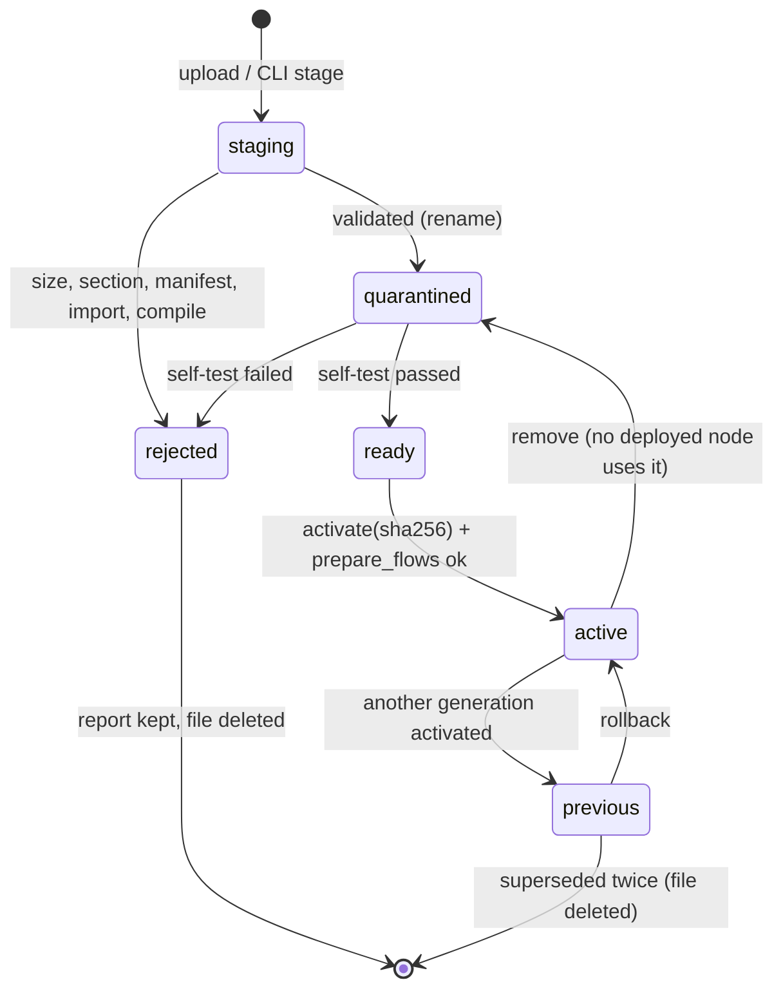

# Phase 7 Design: Optional WASM Node SDK

Status: design accepted with maintainer decisions of 2026-10-05; implements ADR-0002; no product code yet
Author: EdgeLinkd maintainers
Date: 2026-10-05
Depends on: phases 0–6 on `master` (`be2e155`); `adoption/phase7/ADR-0002-wasm-node-sdk.md`
Runtime: Wasmi `=2.0.0` · ABI `edgelink:node/v1` · manifest schema 1 · value encoding EVE/1
Copilot metadata: `NODE_METADATA_VERSION` 1 (unchanged)

## Overview

Phase 7 adds third-party flow nodes compiled to WebAssembly and run by the Wasmi interpreter,
behind the opt-in `nodes_wasm` feature. A plugin is one `.wasm` file with an embedded manifest.
An admin stages it, the runtime validates it, quarantines it, self-tests it, and only then lets
the admin activate it. Activation is atomic, keeps one previous generation, and goes through the
same lock and the same `prepare_flows` → `redeploy_flows` path as a flow deploy.

A plugin is pure computation over messages. It can emit messages, log, set its status and fail
a message. It cannot reach the network, files, environment, clock, randomness, processes,
secrets, context or deploy, because none of those are linkable in ABI v1.

Even in a build with `nodes_wasm`, plugins stay off until the operator sets
`[runtime.wasm] enabled = true`; compiling the feature never starts running whatever is in
`plugins/`.

Builds without `nodes_wasm` (default, `full`, minimal, pymod) gain only one thing: a reserved
`wasm-` type namespace, so a flow that names a plugin fails deploy loudly instead of turning
into the silent `unknown` node.

## Background & Motivation

ADR-0002 settled the runtime question with measurements: Wasmtime's footprint (+13 MiB RSS
after one plugin compile), ARM tiers, MSRV and trusted-artifact model rule it out; Wasmi adds
~1 MiB binary and ~0.6 MiB idle RSS, contains every hostile guest tested, and can enforce a
wall-clock deadline through resumable out-of-fuel calls.

The checkout already has the seams this design needs:

| Existing piece | Where | Used for |
|---|---|---|
| Owned types fail loud | `nodes/mod.rs` `edgelink_owned_node_type`, `missing_owned_node_type`; `flow.rs` `populate_nodes`; `engine.rs` `load_global_nodes` | reserved `wasm-` prefix |
| Swappable registry | `WebState::registry: RwLock<Option<RegistryHandle>>`, `set_registry` | activating a plugin set |
| Single deploy lock | `WebState::deploy: tokio::sync::Mutex<()>`, `deploy.rs` | serialising activation with deploys |
| Candidate validation | `Engine::prepare_flows(json, reg, elcfg)` | proving the graph builds with the new plugin set |
| Restore on failure | `Engine::redeploy_flows` restores the previous graph | activation rollback |
| Bounded agent loop | `Engine::agent_slots` semaphore, `AiAgentNode::handle` | concurrency/deadline pattern |
| Node error/status | `FlowNodeBehavior::report_error`, `report_status`, `fan_out_one/many`, `with_uow` | plugin results |
| Endpoint classes | `crates/web/src/protection.rs` `EndpointClass`, `[api_protection.*]` | new `plugins` class |
| Editor HTML filter | `handlers/nodes.rs` `generate_nodes_html`, `append_bundled_editor` | generated plugin editors |
| Copilot catalog | `handlers/assistant.rs` `catalog_json` | plugin port/config metadata |
| History / audit | `runtime/history.rs` `record_*`, `handlers/audit.rs` `record` | plugin lifecycle events |

## Goals & Non-Goals

### Goals

1. `nodes_wasm` feature: Wasmi host, ABI v1, manifest schema 1, EVE/1 codec, plugin store, admin
   API, CLI, generated editor nodes, Copilot metadata. Off in `default`, `full` and pymod, and
   off at runtime until `[runtime.wasm] enabled = true`.
2. Default-deny authority by construction: only `emit`, `log`, `status`, `fail` are linked.
3. Every plugin call bounded: memory, fuel, wall clock, concurrency, input/output sizes,
   cancellation on stop/redeploy, three-strike failure state.
4. Atomic install: stage → validate → quarantine → self-test → activate; one previous
   generation; rollback; removal that preserves the package; restart ignores partial state.
5. Loud failure for unavailable plugins in every build, naming the plugin identity and version.
6. A guest SDK crate and one example Rust plugin, so the ABI is exercised by real compiled code.
7. Evidence: hostile-plugin tests, crash injection, ADR-0001 measurements, G1 device run.

### Non-goals

- WASI, the component model, wasm-bindgen/JS glue, npm packaging (ADR-0002 §5).
- Any capability beyond the four v1 imports (network, clock, random, context, secrets are each
  a later ADR amendment).
- Remote plugin registries, fleet distribution, publisher signatures (v1 trust is local-admin).
- Third-party editor HTML/JavaScript or icons.
- Hot palette update without an editor reload (v1 asks the admin to reload).
- Plugins that provide config (global) nodes, multiple nodes per package, or more than one input.
- Making `nodes_wasm` default-on (needs a separate decision after target-device data).
- Version bump, tag, or release.

## Key Decisions

| Decision | Choice | Rationale |
|---|---|---|
| Runtime | `wasmi = "=2.0.0"`, `default-features = false`, features `std`, `stable`, `validate`, `auto-dispatch` | ADR-0002. Exact pin: a Wasmi bump is a reviewed change with a hostile-test rerun. |
| Where the host lives | `crates/core/src/runtime/wasm/` (feature-gated) + one flow node in `runtime/nodes/wasm_nodes/` | Same crate as the engine and registry it extends; no new runtime crate to wire through web. |
| Value codec | New `crates/eve` (`edgelink-eve`): `no_std` + `alloc`, zero dependencies, used by the host (optional dep of core) and the guest SDK | One implementation, fuzzed once, identical on both sides. |
| Guest SDK | New `crates/wasm-guest` (`edgelink-wasm-guest`): `no_std` + `alloc`, typed imports, `export_node!` macro | Authors never hand-write the raw ABI. Not a dependency of any shipped binary. |
| Plugin types in the registry | `RegistryImpl` gains an optional `Arc<ActivePlugins>`; a new registry is built per activation | The registry is already the authority on "which types exist" and is already swappable in `WebState`. |
| `MetaNode` for dynamic types | Interned `&'static MetaNode` per (type, inputs, outputs), leaked once | `BaseFlowNodeState::type_str` is `&'static str` and is exported in flow JSON; the real type must appear there, not a generic name. Bounded by `max_plugins` × distinct port shapes. |
| How the node finds its plugin | `Engine` keeps the `ActivePlugins` snapshot of the registry it was built with | Factories only get `&Flow`; `prepare_flows` builds a temporary engine, so the candidate set is what gets validated. |
| Activation restart | Whole-graph `redeploy_flows` of the unchanged flows, under the deploy lock (**decided** 2026-10-05) | Activation is rare; `prepare_flows` + `redeploy_flows` is the path that already restores on failure. Restarting only affected flows would need new engine surface and a second restore path; it can wait (refines ADR-0002 §12 step 5). |
| Engine lifetime | `wasmi::Engine` created on the first plugin node start, dropped with the last; modules cached per engine by SHA-256 | Zero RSS when no plugin node is deployed (ADR §10: ≤ 256 KiB). Recompile cost is 11.6 ms per 138 KiB on the host. |
| Execution thread | `tokio::task::spawn_blocking` while holding a permit from a global semaphore (default 2) | Wasmi calls are synchronous CPU work; permits bound blocking-pool use. Same pattern as `agent_slots`. |
| Output delivery | Collect all `emit`s, send them only if the call returns `0` | A failed call never leaks half its outputs downstream. |
| Package format | Single `.wasm`, manifest in custom section `edgelink.manifest` | No archive extraction at all (ADR §8). |
| State file | `plugins/active.toml`, written temp → fsync → rename → fsync dir | Same atomic-replace discipline as Phase 2 credentials. |
| API prefix | `/wasm/plugins…`, admin-only (**decided** 2026-10-05) | Node-RED's editor already owns `/plugins` and `/plugins/messages`; install/activate there would collide. Not under `/flows` either. |
| CLI | `edgelinkd plugin …` works only when the runtime is **not** running (exclusive `plugins/.lock`) | One writer at a time without inventing IPC; the admin API is the online path. |
| Runtime switch | `[runtime.wasm] enabled` defaults to **false** even when `nodes_wasm` is compiled in; the operator sets `enabled = true` in the configuration overlay (**decided** 2026-10-05) | Same pattern as history: the binary carries the code, configuration turns it on. A default of `true` would run leftover packages on the first `--features nodes_wasm` start. While off, `wasm-*` types fail loud — never a silent no-op — which also makes it the rollback switch. |
| Float instructions | Allowed in v1; SIMD stays off (**decided** 2026-10-05) | Ordinary Rust guests built for `wasm32-unknown-unknown` emit `f32`/`f64` (JSON numbers, `f64` math), so `Config::floats(false)` would reject the guest SDK itself. Bit-identical results across x86, armhf and soft-float armel are not a v1 promise. |

## Proposed Design

### 1. Crates, features and `cfg` matrix

```text
Cargo.toml (root)      nodes_wasm = ["edgelink-core/nodes_wasm", "edgelink-web/nodes_wasm"]
                       (not in default, not in full)
crates/core            nodes_wasm = ["dep:wasmi", "dep:edgelink-eve", "dep:fs2", "dep:toml_edit"]
crates/web             nodes_wasm = ["edgelink-core/nodes_wasm"]
crates/pymod           unchanged (never enables nodes_wasm)
crates/eve             new workspace member, no dependencies, no_std + alloc
crates/wasm-guest      new workspace member, depends on edgelink-eve, no_std + alloc;
                       built for wasm32-unknown-unknown in CI, for the host only in its tests
```

`sha2`, `semver`, `serde`, `serde_json`, `tokio`, `tokio-util`, `log` are already core
dependencies. `toml_edit` (workspace, `serde`) parses the manifest and `active.toml`; `fs2`
(workspace, already optional for `credential_encryption`) provides the directory lock. Both
are measured in the `nodes_wasm` row; neither is linked without the feature.

Always compiled (no feature): the `wasm-` arm in `edgelink_owned_node_type`, the
"not compiled in this build (requires nodes_wasm)" message, and the drift test. That is the
≤ 1 KiB allowed by ADR §10.

| Code | `nodes_wasm` off | on |
|---|---|---|
| `runtime/nodes/mod.rs` owned prefix | yes | yes |
| `runtime/wasm/**`, `runtime/nodes/wasm_nodes/**` | — | yes |
| `Registry::wasm()`, `RegistryBuilder::with_wasm()` | — | yes |
| `InnerEngine::wasm`, admission counters | — | yes |
| `crates/web/src/handlers/wasm_plugins.rs`, `EndpointClass::Plugins` | — | yes |
| generated editor HTML / catalog / Copilot entries | — | yes |
| `src/commands/plugin.rs` (`edgelinkd plugin`) | — | yes |
| `[runtime.wasm]` and `[api_protection.plugins]` parsing | rejected with `NotSupported` if present and `enabled = true` | yes |

A configuration that turns WASM on in a binary without the feature fails startup with
`NotSupported`, rather than being accepted and ignored.

### 2. Core module layout

```text
crates/core/src/runtime/wasm/
  mod.rs          pub use; WasmRuntime; feature-level docs
  settings.rs     WasmSettings from [runtime.wasm], validated at startup
  section.rs      Wasm section walker: header, custom sections, size caps
  manifest.rs     Manifest schema 1: parse (toml_edit/serde), validate, PluginId, type name
  abi.rs          import/export table, Linker construction, export signature checks
  value.rs        Variant <-> EVE/1 (edgelink-eve), message shaping, _msgid rule
  exec.rs         EngineCell, Instance, Budget, fuel-sliced call, HostState
  plugin_set.rs   Generation, ActivePlugins, interned MetaNode
  store.rs        PluginStore: staging/quarantine/store/active.toml, lock, recovery
  lifecycle.rs    stage / validate / quarantine / self_test / activate / rollback / remove
  admission.rs    per-engine memory budget accounting
  fixtures/*.wat  hostile and valid guests for tests (compiled with `wat` dev-dependency)
crates/core/src/runtime/nodes/wasm_nodes/
  mod.rs
  plugin_node.rs  WasmPluginNode: FlowNodeBehavior
```

### 3. Settings (`[runtime.wasm]`)

```toml
[runtime.wasm]
enabled = false                 # default, even with nodes_wasm compiled; true runs active plugins
dir = "plugins"                 # relative to EDGELINK_HOME; must not be a symlink
max_plugins = 16                # active plugin ids
max_module_kib = 512            # .wasm size, enforced while streaming the upload
max_concurrent = 2              # global permits; 1..=available cores
memory_budget_kib = 8192        # per engine: Σ instance memory caps + Σ 8 × module size
default_memory_pages = 32       # 2 MiB
max_memory_pages = 256          # 16 MiB ceiling for manifest requests
default_fuel = 20_000_000       # per message
max_fuel = 1_000_000_000
fuel_slice = 1_000_000
default_deadline_ms = 250
max_deadline_ms = 5000
max_input_kib = 64              # encoded message cap; ceiling 1024
failure_threshold = 3           # traps/limit hits within the window → failed state
failure_window_s = 60
require_signature = false       # true fails startup: signatures are not implemented in v1
```

With `enabled = false` (the default, or the key absent) the runtime neither reads `plugins/`
nor creates an engine, and every `wasm-*` type fails deploy with `NotSupported`.

`WasmSettings::from_config` validates every value (ranges, `default ≤ max`, `fuel_slice ≤
default_fuel`) and fails startup with a message naming the key, like the egress policy does.
G1 (Raspberry Pi 5, arm64) measured 4.8·10⁵ fuel/ms: the default 2·10⁷ fuel is ≈ 42 ms there,
so fuel binds before the 250 ms deadline, and one 10⁶ slice ≈ 2 ms bounds cancellation.

### 4. Package parsing and manifest validation

`section.rs` walks the binary before Wasmi sees it:

1. Magic `\0asm` and version 1; total size ≤ `max_module_kib`.
2. Sections in order: id byte, LEB128 size (≤ remaining bytes, ≤ 5 bytes), payload.
3. Exactly one custom section named `edgelink.manifest`, ≤ 16 KiB, valid UTF-8. Zero or two
   → `manifest missing` / `manifest duplicated`.
4. Other custom sections (`name`, `producers`, `target_features`) are allowed and ignored;
   their combined size counts against the module cap.

`manifest.rs` then deserialises schema 1 (field list in ADR-0002 §8) with
`#[serde(deny_unknown_fields)]` at every level, so a misspelled key is an error, not an ignored
option, and validates:

| Field | Rule |
|---|---|
| `plugin.id` | `^[a-z][a-z0-9]{0,31}/[a-z][a-z0-9]{0,31}$` → `PluginId { publisher, name }` |
| `plugin.version` | `semver::Version`, no build metadata |
| `plugin.abi` | `1` (the host's supported set; v2 adds `2` and keeps `1`) |
| `plugin.license` | 1–64 printable ASCII; shown to the admin, not interpreted |
| `plugin.description`, `node.help` | ≤ 256 B / ≤ 4 KiB, UTF-8, control characters rejected |
| `plugin.capabilities` | must be empty: `unsupported capability '<name>' in ABI 1` |
| `limits.*` | optional; each ≤ the admin ceiling, otherwise install fails naming the limit |
| `node.inputs` | `0` or `1` |
| `node.outputs` | `0..=16` (registry metadata test bound); `output_labels.len() == outputs` |
| `node.color` | `#RRGGBB` |
| `node.icon` | member of the bundled Node-RED icon list generated at build time |
| `node.category` | `^[a-z][a-z0-9 _-]{0,31}$` |
| `node.config[].name` | `^[a-z][a-zA-Z0-9]{0,31}$`, unique, not reserved (`id`, `type`, `z`, `g`, `x`, `y`, `name`, `wires`, `info`, `credentials`, `wasmPlugin`, `_*`) |
| `node.config[].kind` | `string{max_len ≤ 4096}`, `number{min, max, integer}`, `boolean`, `enum{values ≤ 32}`; `default` must satisfy the kind |
| `selftest` | ≤ 4 entries; `input` is a TOML table converted to a message body; `expect_outputs.len() == outputs` |

The node type name is derived, never declared: `wasm-<publisher>-<name>`.

### 5. Value encoding EVE/1 (`crates/eve`)

Framing: `0xEE 0x01` (magic, version), then one value. Little-endian throughout.

| Tag | Value | Payload |
|---:|---|---|
| `0x00` | null | — |
| `0x01` / `0x02` | false / true | — |
| `0x03` | i64 | 8 bytes |
| `0x04` | u64 (only when > `i64::MAX`) | 8 bytes |
| `0x05` | f64, finite only | 8 bytes |
| `0x06` | string | `u32` length + UTF-8 |
| `0x07` | bytes | `u32` length + raw |
| `0x08` | array | `u32` count + values |
| `0x09` | object | `u32` count + (`u32` length + UTF-8 key, value)… keys unique, order preserved |
| `0x0A` | date | `i64` milliseconds since the Unix epoch |
| `0x0B` | regexp | `u32` length + UTF-8 source |

Decoder limits are arguments, not constants: `max_depth` (32), `max_values` (65,536),
`max_len` (the caller's cap). Every length or count is checked against the remaining input
before anything is allocated, so a forged count cannot reserve memory. NaN/±∞, invalid UTF-8,
duplicate keys, unknown tags, trailing bytes and depth overflow are errors with the byte offset.

`value.rs` maps `Variant` ↔ EVE: `Number` → `i64`/`u64`/`f64` by `serde_json::Number`
classification; `Bytes` ↔ bytes; `Date` ↔ date; `Regexp` ↔ regexp (decoded with `regex`'s
size limit); `Object`/`Array`/`String`/`Bool`/`Null` directly. The message body goes to the
guest whole, including `_msgid`. On output: missing `_msgid` → copied from the input; a
different `_msgid` → error; `link_call_stack` → restored from the input. Encoding a value that
has no EVE form fails the message loudly before the guest runs.

### 6. ABI v1 and execution (`abi.rs`, `exec.rs`)

```rust
pub(crate) struct EngineCell {
    engine: wasmi::Engine,                       // consume_fuel, Eager, no start fn, strict limits,
                                                 // floats allowed, SIMD not compiled in
    linker: wasmi::Linker<HostState>,            // only edgelink:node/v1::{emit,log,status,fail}
    modules: Mutex<HashMap<[u8; 32], wasmi::Module>>,
}

pub(crate) struct HostState {
    limits: wasmi::StoreLimits,                  // memory cap, 1 memory, 1 table, 10k elements
    outputs: SmallVec<[(u8, Vec<u8>); 4]>,       // (port, EVE bytes), ≤ 16, Σ ≤ 256 KiB
    logs: SmallVec<[(LogLevel, String); 4]>,     // ≤ 16 × 512 B, control chars stripped
    status: Option<StatusObject>,
    fail: Option<String>,                        // ≤ 1 KiB
    outputs_allowed: u8,                         // manifest outputs
}

pub(crate) struct Budget { fuel: u64, slice: u64, deadline: Instant }

pub(crate) enum WasmFault {
    OutOfFuel { fuel: u64 },
    Deadline { ms: u64, fuel: u64 },
    Cancelled,
    Trap(String),                                // Wasmi trap code / message
    HostLimit { what: &'static str, size: usize, cap: usize },
    Abi(String),                                 // bad pointer, bad port, bad enum value
}
```

`EngineCell::new` builds the linker with exactly four host functions. Each one bounds-checks
`ptr`/`len` against the exported memory, copies out, and either records into `HostState` or
returns a host error (which ends the call as `HostLimit`/`Abi`). Nothing in a host function
blocks, allocates beyond its cap, or calls back into the guest.

`Instance::new(cell, generation, budget)`:

1. `Store::new(engine, HostState)`, `store.limiter(..)`, fuel = one slice.
2. `linker.instantiate_and_start` (start functions were rejected at compile).
3. Check exports: `memory`, `el_abi_version: () -> i32 == 1`, `el_alloc: i32 -> i32`,
   `el_init: (i32, i32) -> i32`, `el_on_input: (i32, i32) -> i32`, optional `el_close: () -> ()`.
4. Call `el_init` with the EVE-encoded validated config under the full budget.

`Instance::call(bytes, budget, cancel: &AtomicBool)`:

```rust
let ptr = self.alloc.call(&mut self.store, len)?;          // under the slice budget
self.memory.write(&mut self.store, ptr, bytes)?;           // bounds-checked by Wasmi
self.store.set_fuel(budget.slice)?;
let mut call = self.on_input.call_resumable(&mut self.store, (ptr, len))?;
let mut granted = budget.slice;
loop {
    match call {
        TypedResumableCall::Finished(code) => return Ok(code),
        TypedResumableCall::HostTrap(t) => return Err(host_fault(t)),
        TypedResumableCall::OutOfFuel(pending) => {
            if cancel.load(Acquire) { return Err(WasmFault::Cancelled) }
            if granted >= budget.fuel { return Err(WasmFault::OutOfFuel { fuel: granted }) }
            if Instant::now() >= budget.deadline { return Err(WasmFault::Deadline { .. }) }
            let slice = budget.slice.max(pending.required_fuel());
            granted += slice;
            self.store.set_fuel(slice)?;
            call = pending.resume(&mut self.store)?;
        }
    }
}
```

This is the spike's loop (`adoption/phase7/spike/src/rt_wasmi.rs`) plus cancellation. A
`required_fuel()` larger than the remaining budget is still bounded: the check against
`budget.fuel` runs before every grant, and one grant is at most one bulk operation over a memory
that is itself capped.

Every `WasmFault` discards the instance; a non-zero return with `fail` text keeps it.

### 7. Registry and engine integration

```rust
// registry.rs
pub trait Registry: 'static + Send + Sync {
    fn all(&self) -> &HashMap<&'static str, &'static MetaNode>;
    fn get(&self, type_name: &str) -> Option<&'static MetaNode>;
    fn hints(&self, type_name: &str) -> Option<&'static NodeHints>;
    #[cfg(feature = "nodes_wasm")]
    fn wasm(&self) -> Option<&Arc<ActivePlugins>>;
}
impl RegistryBuilder {
    #[cfg(feature = "nodes_wasm")]
    pub fn with_wasm(self, plugins: Arc<ActivePlugins>) -> Self;
}
impl RegistryHandle {
    #[cfg(feature = "nodes_wasm")]
    pub fn with_wasm(&self, plugins: Arc<ActivePlugins>) -> RegistryHandle; // same builtins, new set
}
```

`registry.all()` keeps returning built-in types only; plugin types are listed through
`registry.wasm()`. That keeps the existing metadata test (`every_registered_node_has_valid_metadata`)
and the owned-type drift test meaningful.

Type resolution in `flow.rs::populate_nodes` becomes:

```text
reg.get(type)                                   → built-in
type starts with "subflow:"                     → subflow
type starts with "wasm-"                        → wasm::resolve(reg, engine, type)
                                                    feature off       → NotSupported "… not compiled in this build (requires nodes_wasm)"
                                                    enabled = false   → NotSupported "… WASM plugins are disabled by configuration ([runtime.wasm] enabled = false)"
                                                    not active        → NotSupported "… requires WASM plugin acme/csvparse which is not active"
                                                    active            → interned &'static MetaNode
edgelink_owned_node_type(type)                  → NotSupported (unchanged)
otherwise                                       → unknown (unchanged backstop)
```

`engine.rs::load_global_nodes` rejects a `wasm-*` config node with `NotSupported("WASM plugins
provide flow nodes only")`.

`InnerEngine` gains, under the feature, `wasm: Option<Arc<ActivePlugins>>` (copied from the
registry in `with_json`) and `wasm_admission: Mutex<Admission>`. `Admission` sums, per engine,
each plugin node's memory cap plus 8 × module size once per distinct generation; exceeding
`memory_budget_kib` fails node construction with an error naming both numbers. Because
`prepare_flows` builds a throw-away engine, admission is checked on the candidate graph and
nothing is reserved globally.

```rust
pub struct Generation {
    pub id: PluginId,
    pub sha256: [u8; 32],
    pub manifest: Arc<Manifest>,
    pub bytes: Arc<[u8]>,
    pub limits: EffectiveLimits,                // manifest request clamped by settings
    pub meta: &'static MetaNode,                // interned
}
pub struct ActivePlugins {
    by_type: HashMap<String, Arc<Generation>>,  // "wasm-acme-csvparse" → current generation
    previous: HashMap<PluginId, [u8; 32]>,      // for the API listing and rollback
    runtime: Arc<WasmRuntime>,                  // permits, settings, weak EngineCell
}
```

### 8. The flow node (`WasmPluginNode`)

Construction (factory, during `prepare_flows` and real loads):

1. Look up the `Generation` by `node_config.type_name` in the engine's `ActivePlugins`.
2. If the node has `wasmPlugin: "acme/csvparse@<major>"`, the major must equal the active
   version's, else `NotSupported("… requires acme/csvparse@1, active is 2.0.1")`.
3. Validate every manifest config field present in the node JSON against its kind; unknown
   extra properties that are not Node-RED's own (`id`, `type`, `z`, `g`, `x`, `y`, `name`,
   `wires`, `info`, `wasmPlugin`) are rejected — an option the plugin does not declare is an
   error, not an ignored setting.
4. Register its footprint with `Admission`.

No guest code runs during construction, so `prepare_flows` never executes plugins.

Run loop (shape of `AiAgentNode::run`):

```rust
async fn run(self: Arc<Self>, stop: CancellationToken) {
    let guard = self.runtime.engine_cell();     // Arc<EngineCell>: creates the engine if needed
    if let Err(e) = self.start_instance(&guard, &stop).await { self.fail_node(e).await; }
    while !stop.is_cancelled() {
        let cancel = stop.child_token();
        with_uow(self.as_ref(), cancel.child_token(), |node, msg| async move {
            node.handle(msg, cancel).await
        }).await;
    }
    self.close_instance(&stop).await;           // el_close if not cancelled mid-call
}                                               // dropping `guard` may drop the engine
```

`handle(msg)`:

1. If the node is in the failed state, `report_error("wasm plugin acme/csvparse failed: …")`.
2. Encode the body (EVE/1) with `max_input`; failure → node error, guest not called.
3. Acquire a permit with `timeout(deadline)`; timeout → node error "wasm concurrency limit".
4. Move the instance into `spawn_blocking`, run `call` with the `Budget` and an `AtomicBool`
   that a `cancel.cancelled()` task sets; move it back.
5. `0` → decode each output with `max_input`, apply the `_msgid` rule, build `Envelope`s,
   `fan_out_many` in emit order; apply `status` with `report_status`; write logs.
   Non-zero → `report_error(fail text or "guest returned <code>", msg)`.
   `WasmFault` → `report_error`, drop the instance, count a strike; recreate lazily next time.
6. Three strikes within `failure_window_s` → failed state, red ring status
   `plugin failed (3 faults)` until the flow is redeployed.

| Outcome | Node error text (prefix `wasm acme/csvparse:`) | Instance | Strike |
|---|---|---|---|
| fuel exhausted | `fuel budget 20000000 exhausted` | dropped | yes |
| deadline | `deadline 250 ms exceeded` | dropped | yes |
| trap | `trap: <code>` | dropped | yes |
| host bound / ABI misuse | `emit 1048576 bytes exceeds 65536`, `bad output port 3` | dropped | yes |
| guest `fail` / non-zero | the guest's text (≤ 1 KiB) | kept | no |
| input too large / not encodable | `input 70000 bytes exceeds 65536` | kept, not called | no |
| permit timeout | `concurrency limit` | kept | no |
| stop/redeploy mid-call | none (shutdown is not an error) | dropped | no |
| blocking task panicked | `host panic` | dropped | yes |

Guest logs go to `log` with target `edgelink::wasm::<publisher>::<name>`, rate-limited per node
(50/s token bucket); dropped lines are counted in the node status text.

### 9. Plugin store and lifecycle (`store.rs`, `lifecycle.rs`)

Layout under `$EDGELINK_HOME/<dir>` (directories `0700`, files `0600`; every open uses
`O_NOFOLLOW`, and a symlinked root or child stops the store from loading):

```text
plugins/
  .lock                       held exclusively by the runtime for its lifetime (fs2)
  staging/<uuid>.part         upload in progress
  quarantine/<sha256>.wasm    validated; executed only by self-test
  quarantine/<sha256>.json    stage report (id, version, license, limits, self-test result, time)
  store/<sha256>.wasm         immutable generations referenced by active.toml
  active.toml                 the only pointer to what runs
  active.toml.prev            the pointer before the last change (for crash recovery)
```

```toml
# active.toml
schema = 1
[plugins."acme/csvparse"]
current = "3f2a…"   # sha256 hex
previous = "9b1c…"  # optional
activated_at = "2026-10-05T19:00:00Z"
```

State machine for one package:



Operations (all under `WebState::deploy` when online, under `.lock` offline):

| Step | Effect on disk | On failure |
|---|---|---|
| stage | stream to `staging/<uuid>.part` (cap enforced while reading), fsync | delete `.part` |
| validate | sections, manifest, imports/exports, Wasm features, Wasmi eager compile | delete `.part`, report reason |
| quarantine | rename `.part` → `quarantine/<sha>.wasm`, write report | — |
| self-test | fresh `EngineCell` with strict limits: instantiate, `el_init(defaults)`, each `[[selftest]]`, `el_close` | report `rejected`, file kept for inspection, then deleted on next stage |
| activate | prepare → link/rename into `store/` → write pointer (below) → swap registry → redeploy | see crash table |
| rollback | same as activate with `current`/`previous` swapped | same |
| remove | refuse 409 if any deployed node uses the type; else pointer without the id, store file moved to quarantine | pointer unchanged |

Pointer write: `active.toml` → `active.toml.prev` (copy, fsync), new content → `active.toml.tmp`
(fsync) → rename over `active.toml` → fsync directory.

Activation, online:

```rust
let _deploy = state.deploy.lock().await;               // serialises with POST /flows etc.
let current_reg = state.registry.read().await.clone().ok_or(..)?;
let candidate   = current_set.with_generation(store.load_quarantined(&id, &sha)?)?;
let next_reg    = current_reg.with_wasm(Arc::new(candidate));
let attached    = deploy::current_with_credentials(state).await?;  // same merge as rollback_pair
Engine::prepare_flows(&attached, &next_reg, None)?;    // graph must build with the new set
store.promote_and_point(&id, &sha)?;                   // store/ + atomic pointer
state.set_registry(next_reg.clone()).await;
if let Err(e) = engine.redeploy_flows(attached.clone(), &next_reg, None).await {
    store.restore_pointer()?;                          // active.toml.prev → active.toml
    state.set_registry(current_reg.clone()).await;
    engine.redeploy_flows(attached, &current_reg, None).await?;
    return Err(e.into());
}
history.record_plugin("plugin.activated", ..); audit.record(actor, "plugin.activated", None);
```

`flows.json`, `flows_cred.json` and their `.prev` files are read, never written.

Crash recovery at startup (before any flow loads):

| Crash point | Disk state | Startup outcome |
|---|---|---|
| during upload | `staging/*.part` | deleted |
| after quarantine, before activate | `quarantine/<sha>.wasm` | stays quarantined; never auto-activated |
| after `store/` link, before pointer | unreferenced `store/<sha>.wasm` | moved back to quarantine |
| `active.toml.tmp` written, not renamed | old `active.toml` + `.tmp` | `.tmp` deleted; old generation runs |
| after rename, before redeploy | new pointer, process died | new generation loads; if its graph fails, startup restores `.prev` and logs it (online activation only, PR 6; offline activation runs `prepare_flows` before the pointer moves) |
| referenced file missing or digest mismatch | pointer → bad file | that plugin is unavailable; flows using it fail loudly naming it; others run |

With `enabled = false` or the feature off, the directory is neither read nor modified, so a
later re-enable sees exactly what was there.

### 10. Admin API (`crates/web/src/handlers/wasm_plugins.rs`)

All routes require the admin role and belong to a new `EndpointClass::Plugins`.

| Method and path | Body | Result |
|---|---|---|
| `GET /wasm/plugins` | — | active (current/previous), quarantined, rejected reports; no bytes |
| `POST /wasm/plugins/stage` | `application/wasm`, ≤ `max_module_kib` | stage report incl. `sha256`, `license`, limits, self-test |
| `POST /wasm/plugins/{publisher}/{name}/activate` | `{"sha256": "…"}` | `{active, previous, editorReloadRequired: true}` |
| `POST /wasm/plugins/{publisher}/{name}/rollback` | `{"sha256": "<expected previous>"}` | same |
| `DELETE /wasm/plugins/{publisher}/{name}` | — | 409 while a deployed node uses it |
| `DELETE /wasm/plugins/quarantine/{sha256}` | — | deletes a non-active package |

Path segments are matched against the id regex before touching the filesystem; anything else
is 400. `[api_protection.plugins]` defaults: body 1 MiB, headers 32 KiB/128, 6 requests/min,
concurrency 1, header timeout 500 ms, total 30 s, response 64 KiB. Errors use the existing
`DeployErr`-style JSON with a stable `code` (`manifest_invalid`, `import_forbidden`,
`selftest_failed`, `budget_exceeded`, `digest_mismatch`, `in_use`, …).

### 11. Editor, catalog and Copilot

- `generate_nodes_html` appends one generated block per active plugin type, built in Rust from
  the manifest: `RED.nodes.registerType(<type>, {category, color, defaults, inputs, outputs,
  icon, label, outputLabels, paletteLabel})`, a form template with one input per config field,
  and help rendered as escaped text. All manifest strings are JSON-encoded with `<`, `>`, `&`,
  U+2028 and U+2029 escaped before they enter a `<script>`; nothing from the plugin is emitted
  as markup. `defaults` includes `wasmPlugin: {value: "acme/csvparse@1"}`.
- `/nodes` JSON lists each plugin type with `module: "wasm/acme/csvparse"`,
  `version: "1.2.0"`, `local: false`, `user: true`.
- `catalog_json` (Copilot) adds type, inputs, outputs, output labels and config field
  name/kind/required. Description and help are excluded (third-party text in prompts is an
  injection channel). Plugin types count as registered types for `strict_metadata`.
- The editor learns about new types on reload. The activation response says so; there is no
  live palette push in v1.

### 12. Observability

- History (Phase 4): `plugin.staged`, `plugin.rejected`, `plugin.activated`,
  `plugin.rolled_back`, `plugin.removed`, `plugin.failed` (three-strike), with id, version,
  first 12 hex of the digest and a reason code. No bytes, config values or message content.
- Audit: the same kinds for API/CLI actions, with the actor.
- `/status` gains `wasm: {state: "disabled|idle|active", plugins, engineLive, permitsInUse,
  memoryReservedKib}`.
- Per-node status uses the plugin's `status` calls; host-side states (failed, concurrency)
  override them.

### 13. CLI (`src/commands/plugin.rs`)

```text
edgelinkd plugin list
edgelinkd plugin stage <file.wasm>          # prints the stage report and sha256
edgelinkd plugin activate <publisher/name> --sha256 <hex>
edgelinkd plugin rollback <publisher/name> --sha256 <hex>
edgelinkd plugin remove <publisher/name>
edgelinkd plugin verify                     # re-hash store/, check active.toml, report problems
edgelinkd plugin discard <sha256>           # delete a quarantined package (added in PR 4)
edgelinkd plugin pack <module.wasm> <plugin.toml> -o <out.wasm>   # embed the manifest (until PR 7's SDK)
```

The CLI works whether or not `enabled` is set, so an operator can stage and activate before
turning plugins on; nothing executes until the runtime starts with `enabled = true` (self-test
is the one exception, and it runs only on an explicit `stage`). Each command takes the
exclusive `plugins/.lock`; if the runtime holds it, the command exits
with "edgelinkd is running; use the admin API". Offline activation runs `prepare_flows` against
`flows.json` + credentials exactly like the online path, but does not start flows.

The offline path reads credentials through the same credential service as the runtime; if the
encryption key is unavailable the command fails closed instead of validating a graph without
them.

### 14. Guest SDK (`crates/wasm-guest`) and example

```rust
#![no_std]
extern crate alloc;
use edgelink_wasm_guest::{export_node, Ctx, Msg, Node, Status};

struct CsvParse { delimiter: char }

impl Node for CsvParse {
    fn init(config: &edgelink_eve::Value) -> Result<Self, String> { /* read "delimiter" */ }
    fn on_input(&mut self, ctx: &mut Ctx, msg: Msg) -> Result<(), String> {
        // ctx.emit(0, msg)?; ctx.log_info("…"); ctx.status(Status::green_dot("ok"));
    }
}
export_node!(CsvParse);   // generates el_abi_version/el_alloc/el_init/el_on_input/el_close
```

- `Ctx::emit` encodes with EVE/1 and calls the `emit` import; size errors surface as `Err`
  before the host would trap.
- A `manifest!` helper embeds `plugin.toml` as the `edgelink.manifest` custom section via
  `#[link_section]`, so `cargo build --release --target wasm32-unknown-unknown` produces the
  installable file directly. No wasm-pack, no wasm-bindgen.
- The README documents `-C link-arg=-zstack-size=65536` for plugins that must fit in less than
  the 2 MiB default, and `opt-level = "z"` + `lto` for size.
- `examples/csvparse` and `examples/uppercase` are built for `wasm32-unknown-unknown` in CI;
  the resulting `.wasm` files are installed by an end-to-end test in `crates/web`.

## Implementation Plan (PRs)

Each PR is independently reviewable, fmt/clippy clean with `--all-features`, and leaves the
default build unchanged.

| PR | Content | Ships in default build | Gate |
|---|---|---|---|
| 0 | **G1 device run** of the existing spike on a Raspberry Pi-class board; record results in `adoption/phase7/REPORT.md`; set fuel/deadline defaults | no code | **passed 2026-10-05** (Pi 5, arm64) |
| 1 | Reserved `wasm-` prefix in `edgelink_owned_node_type`; messages; drift test (no built-in type starts with `wasm-`); `[runtime.wasm] enabled = true` rejected without the feature | yes (≤ 1 KiB) | — |
| 2 | `crates/eve`: codec, limits, property tests and a fuzz target; no consumer yet | no (not linked) | — |
| 3 | `nodes_wasm` feature skeleton: settings, section walker, manifest, ABI/linker, `exec.rs` with fuel slicing and cancellation; WAT fixtures; hostile execution tests | no | G1 passed; **done on `phase7-design`** except `[[node.config]]` (manifests with config are refused) |
| 4 | Plugin store and lifecycle, offline CLI, crash-injection tests | no | **done on `phase7-design`** (`store.rs` holds the lifecycle; no separate `lifecycle.rs`) |
| 5 | Registry/engine integration, `WasmPluginNode`, admission, flow-level tests (deploy, missing plugin, redeploy cancellation) | no | — |
| 6 | Web: routes, `EndpointClass::Plugins`, online activation under the deploy lock, editor HTML, `/nodes`, Copilot catalog, history/audit, `/status` | no | — |
| 7 | `crates/wasm-guest`, examples, CI `wasm32` build, end-to-end install tests, docs (`docs/operations/wasm-plugins.md`, guest README), README roadmap entry marked experimental, `AGENTS.md` commands table | no | — |
| 8 | `adoption/phase7/REPORT.md`: tests, measurements (host + G1 device + ARM cross builds), rollback drill, unverified boundaries | no | G2 |

CI additions (in `.github/workflows/CICD.yml`):

- Linux: `cargo test -p edgelink-core --features nodes_wasm --lib`,
  `cargo test -p edgelink-web --features nodes_wasm --lib`, `cargo build --features nodes_wasm`.
- Feature-absence check: `cargo tree -e normal -i wasmi` must fail for default,
  `--no-default-features` and `--features full`.
- ARM cross job: add `--features full,nodes_wasm` to the build matrix (build + `--no-run` tests
  under QEMU where the job already runs them).
- `wasm32-unknown-unknown` job for `crates/wasm-guest` and its examples.

## Test Plan

Hostile guests are WAT fixtures compiled in tests with a `wat` dev-dependency (never linked into
a binary). Each row lists the module that owns the test.

| Area | Tests | Module |
|---|---|---|
| Codec | round trip for every tag; offsets in errors; count > remaining; depth 33; 65,537 values; NaN/∞; invalid UTF-8; duplicate key; trailing bytes; unknown tag; property test `decode(encode(v)) == v`; fuzz target never panics | `crates/eve` |
| Sections/manifest | missing/duplicate/oversized manifest; bad LEB; truncated section; every manifest rule in §4; unknown keys; capability listed; limit above ceiling; reserved config names; id traversal (`../x/y`, `a/b/c`, `A/b`, `a-b/c`) | `wasm/section.rs`, `wasm/manifest.rs` |
| ABI | wrong `el_abi_version`; missing/mistyped exports; imported memory; start function; SIMD/threads/memory64 module rejected; `f32`/`f64` module accepted; import from WASI (fs, env, clock, random, proc), `wbg`, unknown `edgelink:node/v1` name, wrong signature | `wasm/abi.rs` |
| CPU | infinite loop → fuel; infinite loop with fuel 10¹¹ → deadline (overshoot ≤ one slice + 5 ms on host); loop in `el_init` and `el_close`; cancellation mid-call returns within one slice | `wasm/exec.rs` |
| Memory | `memory.grow` to the cap traps; allocation bomb via `el_alloc`; table growth; recursion depth; admission rejects a graph over `memory_budget_kib`; engine dropped after the last node stops | `wasm/exec.rs`, `wasm/admission.rs` |
| Host bounds | emit > 64 KiB, 17 emits, Σ > 256 KiB, bad port, pointer past memory end, log/status/fail oversize, bad status enum | `wasm/exec.rs` |
| Node | round trip; multi-port emit order; outputs withheld on failure; `_msgid` kept/forged; `link_call_stack` restored; config validation; undeclared property rejected; `wasmPlugin` major mismatch; three-strike failed state and reset on redeploy; concurrency limit with back-pressure; shutdown during a call | `wasm_nodes/plugin_node.rs`, `engine.rs` tests |
| Registry | feature off: `wasm-x-y` → "not compiled"; feature on with `enabled` absent or `false` → "disabled by configuration", `plugins/` not read, no engine created; not active → names id; global `wasm-*` rejected; third-party `nodered-foo` still `unknown` | `flow.rs`, `registry.rs` |
| Store | stage size cap while streaming; symlinked root/child refused; failure injected at every rename and fsync leaves a complete old or new pointer; startup recovery table in §9; digest mismatch disables only that plugin; restart never promotes quarantine | `wasm/store.rs`, `wasm/lifecycle.rs` |
| Lifecycle drill | install A → upgrade B → C fails self-test (B current, A previous) → C activation fails in `prepare_flows` (unchanged) → rollback B→A → restart → A active; disable feature → non-WASM flows run, no engine created, `plugins/` untouched; re-enable → same state | `crates/web` integration |
| Web | admin-only; 413 over cap; activation needs matching sha256; 409 remove while in use; editor HTML escapes hostile manifest strings (`</script>`, U+2028); Copilot catalog excludes help/description; history/audit contain no bytes or config values | `crates/web` |
| Build | default/minimal/full: no `wasmi`, no routes, no editor or catalog entries, `[runtime.wasm] enabled = true` → startup `NotSupported` | CI + `crates/web` cfg tests |
| End to end | Rust example plugins built for `wasm32` install, run and roll back | CI |

Existing suites (`cargo test --workspace --features full`, `pytest ./tests -v`) must stay green
with the feature off. Plugin nodes are EdgeLinkd-specific: no `scripts/specs_diff.json` entries.

## Measurements

Same method as Phase 0 (`ci` profile, copied fixture, `stat -c %s`, `VmRSS` after 1 s, median
of 5), recorded in `REPORT.md`:

| Row | Budget (ADR-0002 §10) |
|---|---|
| default, `--no-default-features`, `full` | unchanged within noise; ≤ 1 KiB from PR 1 |
| `--features nodes_wasm` binary | ≤ +1.5 MiB vs default |
| idle RSS, feature on, `enabled = false` | ≤ +256 KiB |
| idle RSS, feature on, `enabled = true`, no plugin nodes | ≤ +256 KiB |
| idle RSS, one plugin node (engine live) | ≤ +1 MiB + instance |
| 8 plugin nodes, `bulk`-sized module | within `memory_budget_kib` |
| startup to healthy, feature on, no plugins | ≤ +5 ms |
| per-message latency, 1 KiB `uppercase` | recorded on host and G1 device |
| G1 device | ADR-0002 §11 pass criteria |

## Rollback

- Per plugin: `rollback` (current ↔ previous) or `remove` (back to quarantine).
- Runtime-wide without rebuild: set `[runtime.wasm] enabled = false` (or drop the key; false is
  the default) and restart. Flows that use
  plugins fail deploy/start loudly; the store is untouched.
- Binary: build without `nodes_wasm`. Same loud failure; `plugins/` untouched and readable by a
  later build with the feature.
- Removing nodes from flows before downgrading is the operator's choice; nothing is converted
  or dropped automatically.
- Phase 7 itself: revert PRs 2–8; PR 1 can stay (it only makes a nonexistent type fail loudly).

## Resolved Decisions (maintainer, 2026-10-05)

1. **API prefix: `/wasm/plugins…`.** `/plugins` and `/plugins/messages` are Node-RED editor
   routes; install/activate there would collide. Admin-only `/wasm/plugins…` is the split; not
   under `/flows`.
2. **Restart scope: whole-graph redeploy.** Activation is rare. A second restore path for
   affected flows only is new engine surface and new failure modes; `prepare_flows` +
   `redeploy_flows` under the deploy lock already restores on failure. Targeted restart can wait.
3. **`enabled` defaults to `false`, even with `nodes_wasm` compiled.** Compiling the feature must
   not auto-run leftovers in `plugins/`. The operator sets `[runtime.wasm] enabled = true` in the
   overlay, like history. A default-on switch in a default-off feature is a footgun on the first
   `--features nodes_wasm` run.
4. **Floats allowed in v1; SIMD off.** `wasm32-unknown-unknown` emits `f32`/`f64` for ordinary
   Rust; `Config::floats(false)` would reject the guest SDK. Cross-architecture bit-identical
   results on soft-float ARM are not a v1 promise.

## Files

New: `crates/eve/**`, `crates/wasm-guest/**`, `crates/core/src/runtime/wasm/**`,
`crates/core/src/runtime/nodes/wasm_nodes/**`, `crates/web/src/handlers/wasm_plugins.rs`,
`src/commands/plugin.rs`, `docs/operations/wasm-plugins.md`, `adoption/phase7/REPORT.md`.

Changed: root/core/web `Cargo.toml` (feature, optional deps), `Cargo.lock` (by cargo),
`runtime/nodes/mod.rs`, `runtime/registry.rs`, `runtime/flow.rs`, `runtime/engine.rs`,
`crates/web/src/{api.rs, protection.rs, handlers/nodes.rs, handlers/assistant.rs,
handlers/web_state.rs, handlers/status.rs}`, `src/{cliargs.rs, defaults.rs}`,
`.github/workflows/CICD.yml`, `README.md`, `AGENTS.md`.

Unchanged by design: `deploy.rs` write-set, `flows.json` format, credential storage, egress
policy, pymod features, `scripts/specs_diff.json`.
